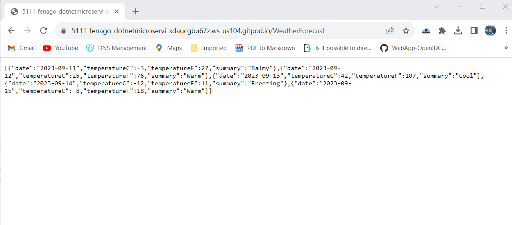
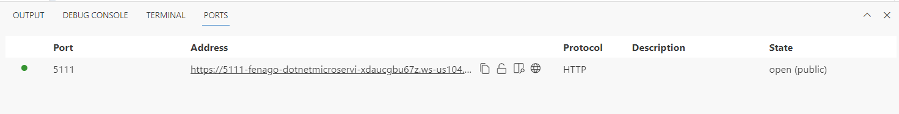

Lab 1: Getting Started with .Net Microservice
---------------------------------------------

**Purpose**

Become familiar with the building blocks for creating microservices with
.NET.

**Prerequisites**

None.


**Scenario**

Create a simple service that returns a list of values using dotnet.


**Install .NET SDK**

To start building .NET apps, download and install the .NET SDK (Software
Development Kit).


```
sudo apt-get update

sudo apt-get install -y dotnet-sdk-7.0
```

Run following command to add dotnet tools in path variable:

```
cat << \EOF >> ~/.bash_profile
# Add .NET Core SDK tools
export PATH="$PATH:/home/gitpod/.dotnet/tools"
EOF
```

Run following command in the terminal to reload bash_profile:

```
source ~/.bash_profile
```

**Check everything installed correctly**

Once you\'ve installed, open a **new** terminal and run the following
command:


``` 
dotnet
```

If the installation succeeded, you should see an output similar to the
following:


``` 
Usage: dotnet [options]
Usage: dotnet [path-to-application]

Options:
-h|--help         Display help.
--info            Display .NET information.
--list-sdks       Display the installed SDKs.
--list-runtimes   Display the installed runtimes.

path-to-application:
The path to an application .dll file to execute.
```


If everything looks good, go to the next step.


**Create your service**

In your terminal, run the following command to create your app:


``` 
dotnet new webapi -n MyMicroservice
```


Then, navigate to the new directory created by the previous command:


``` 
cd MyMicroservice
```


**What do these commands mean?**


The `dotnet` command creates a new application of type `webapi` (that\'s
a REST API endpoint).

-   The `-n` parameter creates a directory named `MyMicroservice` where
    your app is stored.
-   The `--no-https` flag creates an app that will run without an HTTPS
    certificate, to keep things simple for deployment.
-   The `-f` parameter indicates you\'re creating a .NET 7 application.

The `cd MyMicroservice` command puts you into the newly created app
directory.

**The generated code**

Several files were created in the `MyMicroservice` directory, to give
you a simple service that is ready to run.

-   `MyMicroservice.csproj` defines what libraries the project
    references, etc.
-   `Program.cs` contains all the settings and configuration that are
    loaded when the app starts.
-   `Controllers/WeatherForecastController.cs` has code for a simple API
    that returns the weather forecast for the next five days.
-   The `launchSettings.json` file inside the `Properties` directory
    defines different profile settings for the local development
    environment. A port number ranging between 5000-5300 is
    automatically assigned at project creation and saved on this file.

The following code shows the contents of the
`WeatherForecastController.cs` file located in the `Controllers`
directory:


``` 
using Microsoft.AspNetCore.Mvc;

namespace MyMicroservice.Controllers;

[ApiController]
[Route("[controller]")]
public class WeatherForecastController : ControllerBase
{
    private static readonly string[] Summaries = new[]
    {
        "Freezing", "Bracing", "Chilly", "Cool", "Mild", "Warm", "Balmy", "Hot", "Sweltering", "Scorching"
    };

    private readonly ILogger<WeatherForecastController> _logger;

    public WeatherForecastController(ILogger<WeatherForecastController> logger)
    {
        _logger = logger;
    }

    [HttpGet(Name = "GetWeatherForecast")]
    public IEnumerable<WeatherForecast> Get()
    {
        return Enumerable.Range(1, 5).Select(index => new WeatherForecast
        {
            Date = DateOnly.FromDateTime(DateTime.Now.AddDays(index)),
            TemperatureC = Random.Shared.Next(-20, 55),
            Summary = Summaries[Random.Shared.Next(Summaries.Length)]
        })
        .ToArray();
    }
}
```


Run your service
----------------

In your terminal, run the following command:


``` 
dotnet run
```

You should see an output similar to the following:


``` 
Building...
info: Microsoft.Hosting.Lifetime[14]
      Now listening on: http://localhost:5111
info: Microsoft.Hosting.Lifetime[0]
      Application started. Press Ctrl+C to shut down.
info: Microsoft.Hosting.Lifetime[0]
      Hosting environment: Development
info: Microsoft.Hosting.Lifetime[0]
      Content root path: /workspace/dotnet-microservices/MyMicroservice
warn: Microsoft.AspNetCore.HttpsPolicy.HttpsRedirectionMiddleware[3]
```


Wait for the app to display that it\'s listening and then open a browser and
navigate to `https://PORT-YOUR_GITPOD_URL.gitpod.io/WeatherForecast`

In this exercise, it showed that it was listening on port `5111` and it might be **differnet port** for you, so the following image shows the URL `https://PORT-YOUR_GITPOD_URL.gitpod.io/WeatherForecast`.




**Note:** You can copy gitpod URL from `PORTS` icon in the integrated terminal to access the application.



Congratulations, you\'ve got a .Net service running!
