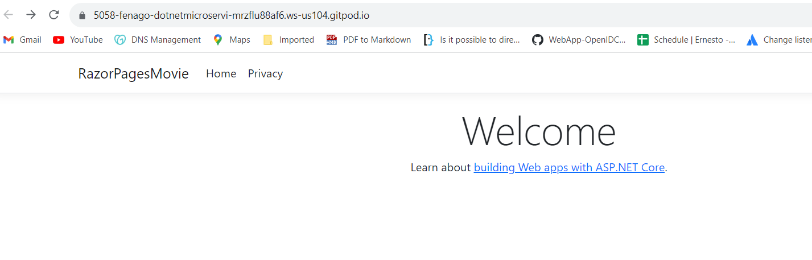
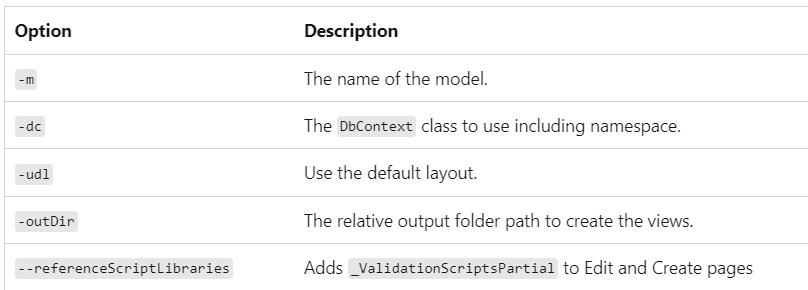

Lab: Razor Pages web app with ASP.NET Core
==========================================

This lab explains the basics of building a Razor Pages web app.

This series includes the following tutorials:

1.  Create a Razor Pages web
    app
2.  Add a model to a Razor Pages
    app
3.  Scaffold (generate) Razor
    pages
4.  Work with a
    database
5.  Update Razor
    pages
6.  Add
    search
7.  Add a new
    field
8.  Add
    validation

At the end, you\'ll have an app that can display and manage a database
of movies.


Exercise: Get started with Razor Pages in ASP.NET Core
======================================================


In this lab
---------------

1.  Prerequisites
2.  Create a Razor Pages web
    app
3.  Run the
    app
4.  Examine the project
    files
5.  Troubleshooting with the completed
    sample


This is the first exercise of a series that teaches the basics of
building an ASP.NET Core Razor Pages web app.

At the end of this lab, you\'ll have a Razor Pages web app that
manages a database of movies.


Create a Razor Pages web app
----------------------------

1.  Open the **Integrated Terminal**.

2.  Change to the directory (`cd`) that will contain the project.

3.  Run the following commands:


    ``` 
    dotnet new webapp -o RazorPagesMovie
    ```

    The `dotnet new` command creates a new Razor Pages project in the
    *RazorPagesMovie* folder.

    Now, open the *RazorPagesMovie* folder in the visual studio code.


Run the app
-----------

-   Runs the app, which launches the [Kestrel server].
        
    ``` 
    dotnet run
    ```

-   Launch the browser at `https://PORT-YOUR_GITPOD_URL.gitpod.io`, which
    displays the apps UI. `<port>` is the random port that is assigned
    when the app was created and is set in `Properties/launchSettings.json`.

    

Examine the project files
-------------------------


The following sections contain an overview of the main project folders
and files that you\'ll work with in later labs.

### Pages folder

Contains Razor pages and supporting files. Each Razor page is a pair of
files:

-   A `.cshtml` file that has HTML markup with C\# code using Razor
    syntax.
-   A `.cshtml.cs` file that has C\# code that handles page events.

Supporting files have names that begin with an underscore. For example,
the `_Layout.cshtml` file configures UI elements common to all pages.
`_Layout.cshtml` sets up the navigation menu at the top of the page and
the copyright notice at the bottom of the page.


#### wwwroot folder

Contains static assets, like HTML files, JavaScript files, and CSS
files.

#### `appsettings.json`

Contains configuration data, like connection strings.

#### Program.cs

Contains the following code:


``` 
var builder = WebApplication.CreateBuilder(args);

// Add services to the container.
builder.Services.AddRazorPages();

var app = builder.Build();

// Configure the HTTP request pipeline.
if (!app.Environment.IsDevelopment())
{
    app.UseExceptionHandler("/Error");
    app.UseHsts();
}

app.UseHttpsRedirection();
app.UseStaticFiles();

app.UseRouting();

app.UseAuthorization();

app.MapRazorPages();

app.Run();
```

The following lines of code in this file create a
`WebApplicationBuilder` with preconfigured defaults, add Razor Pages
support to the [Dependency Injection (DI)
container],
and builds the app:


``` 
var builder = WebApplication.CreateBuilder(args);

// Add services to the container.
builder.Services.AddRazorPages();

var app = builder.Build();
```

The developer exception page is enabled by default and provides helpful
information on exceptions. Production apps should not be run in
development mode because the developer exception page can leak sensitive
information.

The following code sets the exception endpoint to `/Error` and enables
[HTTP Strict Transport Security Protocol
(HSTS)]
when the app is ***not*** running in development mode:


``` 
// Configure the HTTP request pipeline.
if (!app.Environment.IsDevelopment())
{
    app.UseExceptionHandler("/Error");
    app.UseHsts();
}
```

For example, the preceding code runs when the app is in production or
test mode.


The following code enables various
[Middleware]:

-   `app.UseHttpsRedirection();` : Redirects HTTP requests to HTTPS.
-   `app.UseStaticFiles();` : Enables static files, such as HTML, CSS,
    images, and JavaScript to be served.
-   `app.UseRouting();` : Adds route matching to the middleware
    pipeline.
-   `app.MapRazorPages();`: Configures endpoint routing for Razor Pages.
-   `app.UseAuthorization();` : Authorizes a user to access secure
    resources. This app doesn\'t use authorization, therefore this line
    could be removed.
-   `app.Run();` : Runs the app.


Part 2: add a model to a Razor Pages app in ASP.NET Core
========================================================


In this lab
---------------

1.  Add a data
    model
2.  Scaffold the movie
    model
3.  Create the initial database schema using EF\'s migration
    feature
4.  Test the
    app
5.  Troubleshooting with the completed
    sample
6.  Next
    steps


In this lab, classes are added for managing movies in a database.
The app\'s model classes use [Entity Framework Core (EF
Core)] to work with the
database. EF Core is an object-relational mapper (O/RM) that simplifies
data access. You write the model classes first, and EF Core creates the
database.

The model classes are known as POCO classes (from "Plain-Old CLR Objects") because they don't have a dependency on EF Core. They define the properties of the data that are stored in the database.


Add a data model
----------------


1.  Add a folder named `Models`.
2.  Add a class to the `Models` folder named `Movie.cs`.

Add the following properties to the `Movie` class:


``` 
using System.ComponentModel.DataAnnotations;

namespace RazorPagesMovie.Models;

public class Movie
{
    public int Id { get; set; }
    public string? Title { get; set; }
    [DataType(DataType.Date)]
    public DateTime ReleaseDate { get; set; }
    public string? Genre { get; set; }
    public decimal Price { get; set; }
}
```

The `Movie` class contains:

-   An `ID` field to provide a primary key for the database.

-   A
    [\[DataType\]]
    attribute to specify the type of data in the `ReleaseDate` field.
    With this attribute:

    -   The user is not required to enter time information in the date
        field.
    -   Only the date is displayed, not time information.

-   The question mark after `string` indicates that the property is
    nullable.


### Add NuGet packages and EF tools

Run the following .NET CLI commands one by one:


``` 
dotnet tool uninstall --global dotnet-aspnet-codegenerator
dotnet tool install --global dotnet-aspnet-codegenerator
dotnet tool uninstall --global dotnet-ef
dotnet tool install --global dotnet-ef
dotnet add package Microsoft.EntityFrameworkCore.Design
dotnet add package Microsoft.EntityFrameworkCore.SQLite
dotnet add package Microsoft.VisualStudio.Web.CodeGeneration.Design
dotnet add package Microsoft.EntityFrameworkCore.SqlServer
dotnet add package Microsoft.EntityFrameworkCore.Tools
```

The preceding commands add:

-   The command-line interface (CLI) tools for EF Core
-   The aspnet-codegenerator scaffolding tool.
-   Design time tools for EF Core
-   The EF Core SQLite provider, which installs the EF Core package as a
    dependency.
-   Packages needed for scaffolding:
    `Microsoft.VisualStudio.Web.CodeGeneration.Design` and
    `Microsoft.EntityFrameworkCore.SqlServer`.


Build the project to verify there are no compilation errors.

`dotnet build`


Scaffold the movie model
------------------------

In this section, the movie model is scaffolded. That is, the scaffolding
tool produces pages for Create, Read, Update, and Delete (CRUD)
operations for the movie model.


-   Open a command shell to the project directory, which contains the
    `Program.cs` and `.csproj` files. Run the following command:

    ``` 
    dotnet aspnet-codegenerator razorpage -m Movie -dc RazorPagesMovie.Data.RazorPagesMovieContext -udl -outDir Pages/Movies --referenceScriptLibraries --databaseProvider sqlite
    ```


The following table details the ASP.NET Core code
generator options.





Use the `-h` option to get help on the
`dotnet aspnet-codegenerator razorpage` command:


``` 
dotnet aspnet-codegenerator razorpage -h
```


### Use SQLite for development

When SQLite is selected, the template generated code is ready for
development. The following code shows how to select the SQLite
connection string in development and SQL Server in production.


Add following code in `program.cs`:

``` 
using Microsoft.EntityFrameworkCore;

var builder = WebApplication.CreateBuilder(args);

builder.Services.AddRazorPages();

if (builder.Environment.IsDevelopment())
{
    builder.Services.AddDbContext<RazorPagesMovieContext>(options =>
        options.UseSqlite(builder.Configuration.GetConnectionString("RazorPagesMovieContext")));
}
else
{
    builder.Services.AddDbContext<RazorPagesMovieContext>(options =>
        options.UseSqlServer(builder.Configuration.GetConnectionString("ProductionMovieContext")));
}

var app = builder.Build();

if (!app.Environment.IsDevelopment())
{
    app.UseExceptionHandler("/Error");
    app.UseHsts();
}

app.UseHttpsRedirection();
app.UseStaticFiles();

app.UseRouting();

app.UseAuthorization();

app.MapRazorPages();

app.Run();
```

The preceding code doesn\'t call `UseDeveloperExceptionPage` in
development because `WebApplication` calls `UseDeveloperExceptionPage`
in development mode.


### Files created and updated

The scaffold process creates the following files:

-   *Pages/Movies*: Create, Delete, Details, Edit, and Index.
-   `Data/RazorPagesMovieContext.cs`

The created files are explained in the next tutorial.

The scaffold process adds the following highlighted code to the
`Program.cs` file:

```
using Microsoft.EntityFrameworkCore;
using Microsoft.Extensions.DependencyInjection;
var builder = WebApplication.CreateBuilder(args);

// Add services to the container.
builder.Services.AddRazorPages();
builder.Services.AddDbContext<RazorPagesMovieContext>(options =>
    options.UseSqlite(builder.Configuration.GetConnectionString("RazorPagesMovieContext") ?? throw new InvalidOperationException("Connection string 'RazorPagesMovieContext' not found.")));

var app = builder.Build();

// Configure the HTTP request pipeline.
if (!app.Environment.IsDevelopment())
{
    app.UseExceptionHandler("/Error");
    // The default HSTS value is 30 days. You may want to change this for production scenarios, see https://aka.ms/aspnetcore-hsts.
    app.UseHsts();
}

app.UseHttpsRedirection();
app.UseStaticFiles();

app.UseRouting();

app.UseAuthorization();

app.MapRazorPages();

app.Run();
```


The `Program.cs` changes are explained later in this lab.


Create the initial database schema using EF\'s migration feature
----------------------------------------------------------------


-   Right-click the *RazorPagesMovie.csproj* project, and then select
    **Open in Integrated Terminal**.

    The **Terminal** window opens with the command prompt at the project
    directory, which contains the Program.cs and .csproj files.

-   Run the following .NET CLI commands:


    ``` 
    dotnet ef migrations add InitialCreate
    dotnet ef database update
    ```

-   The `migrations` command generates code to create the initial
    database schema. The schema is based on the model specified in
    `DbContext`. The `InitialCreate` argument is used to name the
    migrations. Any name can be used, but by convention a name is
    selected that describes the migration.

-   The `update` command runs the `Up` method in migrations that have
    not been applied. In this case, `update` runs the `Up` method in the
    `Migrations/<time-stamp>_InitialCreate.cs` file, which creates the
    database.


**Note**

For SQLite, column type for the `Price` field is set to `TEXT`. This is
resolved in a later step.


The following warning is displayed, which is addressed in a later step:

> No type was specified for the decimal column \'Price\' on entity type
> \'Movie\'. This will cause values to be silently truncated if they do
> not fit in the default precision and scale. Explicitly specify the SQL
> server column type that can accommodate all the values using
> \'HasColumnType()\'.

The data context `RazorPagesMovieContext`:

-   Derives from
    [Microsoft.EntityFrameworkCore.DbContext].
-   Specifies which entities are included in the data model.
-   Coordinates EF Core functionality, such as Create, Read, Update and
    Delete, for the `Movie` model.


``` 
using System;
using System.Collections.Generic;
using System.Linq;
using System.Threading.Tasks;
using Microsoft.EntityFrameworkCore;
using RazorPagesMovie.Models;

namespace RazorPagesMovie.Data
{
    public class RazorPagesMovieContext : DbContext
    {
        public RazorPagesMovieContext (DbContextOptions<RazorPagesMovieContext> options)
            : base(options)
        {
        }

        public DbSet<RazorPagesMovie.Models.Movie> Movie { get; set; } = default!;
    }
}
```

The preceding code creates a
[DbSet\<Movie\>]
property for the entity set. In Entity Framework terminology, an entity
set typically corresponds to a database table. An entity corresponds to
a row in the table.

The name of the connection string is passed in to the context by calling
a method on a
[DbContextOptions]
object. For local development, the [Configuration
system]
reads the connection string from the `appsettings.json` file.


Test the app
------------


1.  Run the app and append `/Movies` to the URL in the browser
    (`http://localhost:port/movies`).

    If you receive the following error:


    ``` 
    SqlException: Cannot open database "RazorPagesMovieContext-GUID" requested by the login. The login failed.
    Login failed for user 'User-name'.
    ```

    You missed the migrations step.

2.  Test the **Create New** link.

    


3.  Test the **Edit**, **Details**, and **Delete** links.

The next tutorial explains the files created by scaffolding.

### Examine the context registered with dependency injection


ASP.NET Core is built with [dependency
injection].
Services, such as the EF Core database context, are registered with
dependency injection during application startup. Components that require
these services (such as Razor Pages) are provided via constructor
parameters. The constructor code that gets a database context instance
is shown later in the tutorial.

The scaffolding tool automatically created a database context and
registered it with the dependency injection container. The following
highlighted code is added to the `Program.cs` file by the scaffolder:


```
using Microsoft.EntityFrameworkCore;
using Microsoft.Extensions.DependencyInjection;
var builder = WebApplication.CreateBuilder(args);

// Add services to the container.
builder.Services.AddRazorPages();
builder.Services.AddDbContext<RazorPagesMovieContext>(options =>
    options.UseSqlite(builder.Configuration.GetConnectionString("RazorPagesMovieContext") ?? throw new InvalidOperationException("Connection string 'RazorPagesMovieContext' not found.")));

var app = builder.Build();

// Configure the HTTP request pipeline.
if (!app.Environment.IsDevelopment())
{
    app.UseExceptionHandler("/Error");
    // The default HSTS value is 30 days. You may want to change this for production scenarios, see https://aka.ms/aspnetcore-hsts.
    app.UseHsts();
}

app.UseHttpsRedirection();
app.UseStaticFiles();

app.UseRouting();

app.UseAuthorization();

app.MapRazorPages();

app.Run();
```


Part 3, scaffolded Razor Pages in ASP.NET Core
==============================================


In this lab
---------------

1.  The Create, Delete, Details, and Edit
    pages
2.  Next
    steps

This lab examines the Razor Pages created by scaffolding in the
previous section.


The Create, Delete, Details, and Edit pages
-------------------------------------------


Examine the `Pages/Movies/Index.cshtml.cs` Page Model:


```
using Microsoft.AspNetCore.Mvc.RazorPages;
using Microsoft.EntityFrameworkCore;
using RazorPagesMovie.Models;

namespace RazorPagesMovie.Pages.Movies;

public class IndexModel : PageModel
{
    private readonly RazorPagesMovie.Data.RazorPagesMovieContext _context;

    public IndexModel(RazorPagesMovie.Data.RazorPagesMovieContext context)
    {
        _context = context;
    }

    public IList<Movie> Movie { get;set; }  = default!;

    public async Task OnGetAsync()
    {
        if (_context.Movie != null)
        {
            Movie = await _context.Movie.ToListAsync();
        }
    }
}
```

Razor Pages are derived from
[PageModel].
By convention, the `PageModel` derived class is named `PageNameModel`.
For example, the Index page is named `IndexModel`.

The constructor uses [dependency
injection]
to add the `RazorPagesMovieContext` to the page:


``` 
public class IndexModel : PageModel
{
    private readonly RazorPagesMovie.Data.RazorPagesMovieContext _context;

    public IndexModel(RazorPagesMovie.Data.RazorPagesMovieContext context)
    {
        _context = context;
    }
}
```

When a `GET` request is made for the page, the `OnGetAsync` method
returns a list of movies to the Razor Page. On a Razor Page,
`OnGetAsync` or `OnGet` is called to initialize the state of the page.
In this case, `OnGetAsync` gets a list of movies and displays them.

When `OnGet` returns `void` or `OnGetAsync` returns `Task`, no return
statement is used. For example, examine the Privacy Page:


``` 
using Microsoft.AspNetCore.Mvc;
using Microsoft.AspNetCore.Mvc.RazorPages;

namespace RazorPagesMovie.Pages
{
    public class PrivacyModel : PageModel
    {
        private readonly ILogger<PrivacyModel> _logger;

        public PrivacyModel(ILogger<PrivacyModel> logger)
        {
            _logger = logger;
        }

        public void OnGet()
        {
        }
    }
}
```

When the return type is
[IActionResult]
or `Task<IActionResult>`, a return statement must be provided. For
example, the `Pages/Movies/Create.cshtml.cs OnPostAsync` method:


``` 
public async Task<IActionResult> OnPostAsync()
{
  if (!ModelState.IsValid)
    {
        return Page();
    }

    _context.Movie.Add(Movie);
    await _context.SaveChangesAsync();

    return RedirectToPage("./Index");
}
```


Examine the `Pages/Movies/Index.cshtml` Razor Page:


``` 
@page
@model RazorPagesMovie.Pages.Movies.IndexModel

@{
    ViewData["Title"] = "Index";
}

<h1>Index</h1>

<p>
    <a asp-page="Create">Create New</a>
</p>
<table class="table">
    <thead>
        <tr>
            <th>
                @Html.DisplayNameFor(model => model.Movie[0].Title)
            </th>
            <th>
                @Html.DisplayNameFor(model => model.Movie[0].ReleaseDate)
            </th>
            <th>
                @Html.DisplayNameFor(model => model.Movie[0].Genre)
            </th>
            <th>
                @Html.DisplayNameFor(model => model.Movie[0].Price)
            </th>
            <th></th>
        </tr>
    </thead>
    <tbody>
@foreach (var item in Model.Movie) {
        <tr>
            <td>
                @Html.DisplayFor(modelItem => item.Title)
            </td>
            <td>
                @Html.DisplayFor(modelItem => item.ReleaseDate)
            </td>
            <td>
                @Html.DisplayFor(modelItem => item.Genre)
            </td>
            <td>
                @Html.DisplayFor(modelItem => item.Price)
            </td>
            <td>
                <a asp-page="./Edit" asp-route-id="@item.Id">Edit</a> |
                <a asp-page="./Details" asp-route-id="@item.Id">Details</a> |
                <a asp-page="./Delete" asp-route-id="@item.Id">Delete</a>
            </td>
        </tr>
}
    </tbody>
</table>
```

Razor can transition from HTML into C\# or into Razor-specific markup.
When an `@` symbol is followed by a [Razor reserved
keyword],
it transitions into Razor-specific markup, otherwise it transitions into
C\#.


#### The [\@page] directive


The `@page` Razor directive makes the file an MVC action, which means
that it can handle requests. `@page` must be the first Razor directive
on a page. `@page` and `@model` are examples of transitioning into
Razor-specific markup.


#### The [\@model] directive


``` 
@page
@model RazorPagesMovie.Pages.Movies.IndexModel
```

The `@model` directive specifies the type of the model passed to the
Razor Page. In the preceding example, the `@model` line makes the
`PageModel` derived class available to the Razor Page. The model is used
in the `@Html.DisplayNameFor` and `@Html.DisplayFor` [HTML
Helpers]
on the page.

Examine the lambda expression used in the following HTML Helper:


``` 
@Html.DisplayNameFor(model => model.Movie[0].Title)
```

The
[DisplayNameFor]
HTML Helper inspects the `Title` property referenced in the lambda
expression to determine the display name. The lambda expression is
inspected rather than evaluated. That means there is no access violation
when `model`, `model.Movie`, or `model.Movie[0]` is `null` or empty.
When the lambda expression is evaluated, for example, with
`@Html.DisplayFor(modelItem => item.Title)`, the model\'s property
values are evaluated.
### The layout page


Select the menu links **RazorPagesMovie**, **Home**, and **Privacy**.
Each page shows the same menu layout. The menu layout is implemented in
the `Pages/Shared/_Layout.cshtml` file.

Open and examine the `Pages/Shared/_Layout.cshtml` file.

[Layout]
templates allow the HTML container layout to be:

-   Specified in one place.
-   Applied in multiple pages in the site.

Find the `@RenderBody()` line. `RenderBody` is a placeholder where all
the page-specific views show up, *wrapped* in the layout page. For
example, select the **Privacy** link and the `Pages/Privacy.cshtml` view
is rendered inside the `RenderBody` method.


### ViewData and layout


Consider the following markup from the `Pages/Movies/Index.cshtml` file:


``` 
@page
@model RazorPagesMovie.Pages.Movies.IndexModel

@{
    ViewData["Title"] = "Index";
}
```

The preceding highlighted markup is an example of Razor transitioning
into C\#. The `{` and `}` characters enclose a block of C\# code.

The `PageModel` base class contains a `ViewData` dictionary property
that can be used to pass data to a View. Objects are added to the
`ViewData` dictionary using a ***key value*** pattern. In the preceding
sample, the `Title` property is added to the `ViewData` dictionary.

The `Title` property is used in the `Pages/Shared/_Layout.cshtml` file.
The following markup shows the first few lines of the `_Layout.cshtml`
file.


``` 
<!DOCTYPE html>
<html lang="en">
<head>
    <meta charset="utf-8" />
    <meta name="viewport" content="width=device-width, initial-scale=1.0" />
    <title>@ViewData["Title"] - RazorPagesMovie</title>
    <link rel="stylesheet" href="~/lib/bootstrap/dist/css/bootstrap.min.css" />
    <link rel="stylesheet" href="~/css/site.css" asp-append-version="true" />
    <link rel="stylesheet" href="~/RazorPagesMovie.styles.css" asp-append-version="true" />
```

The line `@*Markup removed for brevity.*@` is a Razor comment. Unlike
HTML comments `<!-- -->`, Razor comments are not sent to the client.


### Update the layout


1.  Change the `<title>` element in the `Pages/Shared/_Layout.cshtml`
    file to display **Movie** rather than **RazorPagesMovie**.

    
    

    ``` 
    <!DOCTYPE html>
    <html lang="en">
    <head>
        <meta charset="utf-8" />
        <meta name="viewport" content="width=device-width, initial-scale=1.0" />
        <title>@ViewData["Title"] - Movie</title>
    ```

2.  Find the following anchor element in the
    `Pages/Shared/_Layout.cshtml` file.

    
    

    ``` 
    <a class="navbar-brand" asp-area="" asp-page="/Index">RazorPagesMovie</a>
    ```

3.  Replace the preceding element with the following markup:

    
    

    ``` 
    <a class="navbar-brand" asp-page="/Movies/Index">RpMovie</a>
    ```

    The preceding anchor element is a [Tag
    Helper].
    In this case, it\'s the [Anchor Tag
    Helper].
    The `asp-page="/Movies/Index"` Tag Helper attribute and value
    creates a link to the `/Movies/Index` Razor Page. The `asp-area`
    attribute value is empty, so the area isn\'t used in the link. See
    [Areas]
    for more information.

4.  Save the changes and test the app by selecting the **RpMovie** link.
    See the `Layout.cshtml` file if you have any problems:

    ```
    <!DOCTYPE html>
<html lang="en">
<head>
    <meta charset="utf-8" />
    <meta name="viewport" content="width=device-width, initial-scale=1.0" />
    <title>@ViewData["Title"] - Movie</title>
    <link rel="stylesheet" href="~/lib/bootstrap/dist/css/bootstrap.min.css" />
    <link rel="stylesheet" href="~/css/site.css" asp-append-version="true" />
    <link rel="stylesheet" href="~/RazorPagesMovie.styles.css" asp-append-version="true" />
</head>
<body>
    <header>
        <nav class="navbar navbar-expand-sm navbar-toggleable-sm navbar-light bg-white border-bottom box-shadow mb-3">
            <div class="container">
                <a class="navbar-brand" asp-page="/Movies/Index">RpMovie</a>
                <button class="navbar-toggler" type="button" data-bs-toggle="collapse" data-bs-target=".navbar-collapse" aria-controls="navbarSupportedContent"
                        aria-expanded="false" aria-label="Toggle navigation">
                    <span class="navbar-toggler-icon"></span>
                </button>
                <div class="navbar-collapse collapse d-sm-inline-flex justify-content-between">
                    <ul class="navbar-nav flex-grow-1">
                        <li class="nav-item">
                            <a class="nav-link text-dark" asp-area="" asp-page="/Index">Home</a>
                        </li>
                        <li class="nav-item">
                            <a class="nav-link text-dark" asp-area="" asp-page="/Privacy">Privacy</a>
                        </li>
                    </ul>
                </div>
            </div>
        </nav>
    </header>
    <div class="container">
        <main role="main" class="pb-3">
            @RenderBody()
        </main>
    </div>

    <footer class="border-top footer text-muted">
        <div class="container">
            &copy; 2023 - RazorPagesMovie - <a asp-area="" asp-page="/Privacy">Privacy</a>
        </div>
    </footer>

    <script src="~/lib/jquery/dist/jquery.min.js"></script>
    <script src="~/lib/bootstrap/dist/js/bootstrap.bundle.min.js"></script>
    <script src="~/js/site.js" asp-append-version="true"></script>

    @await RenderSectionAsync("Scripts", required: false)
</body>
</html>
    ```

5.  Test the **Home**, **RpMovie**, **Create**, **Edit**, and **Delete**
    links. Each page sets the title, which you can see in the browser
    tab. When you bookmark a page, the title is used for the bookmark.


The `Layout` property is set in the `Pages/_ViewStart.cshtml` file:


``` 
@{
    Layout = "_Layout";
}
```

The preceding markup sets the layout file to
`Pages/Shared/_Layout.cshtml` for all Razor files under the *Pages*
folder.


### The Create page model

Examine the `Pages/Movies/Create.cshtml.cs` page model:


``` 
using Microsoft.AspNetCore.Mvc;
using Microsoft.AspNetCore.Mvc.RazorPages;
using RazorPagesMovie.Models;

namespace RazorPagesMovie.Pages.Movies
{
    public class CreateModel : PageModel
    {
        private readonly RazorPagesMovie.Data.RazorPagesMovieContext _context;

        public CreateModel(RazorPagesMovie.Data.RazorPagesMovieContext context)
        {
            _context = context;
        }

        public IActionResult OnGet()
        {
            return Page();
        }

        [BindProperty]
        public Movie Movie { get; set; } = default!;
        

        // To protect from overposting attacks, see https://aka.ms/RazorPagesCRUD
        public async Task<IActionResult> OnPostAsync()
        {
          if (!ModelState.IsValid || _context.Movie == null || Movie == null)
            {
                return Page();
            }

            _context.Movie.Add(Movie);
            await _context.SaveChangesAsync();

            return RedirectToPage("./Index");
        }
    }
}
```

The `OnGet` method initializes any state needed for the page. The Create
page doesn\'t have any state to initialize, so `Page` is returned. Later
in the tutorial, an example of `OnGet` initializing state is shown. The
`Page` method creates a `PageResult` object that renders the
`Create.cshtml` page.

The `Movie` property uses the
[\[BindProperty\]]
attribute to opt-in to [model
binding].
When the Create form posts the form values, the ASP.NET Core runtime
binds the posted values to the `Movie` model.

The `OnPostAsync` method is run when the page posts form data:


``` 
public async Task<IActionResult> OnPostAsync()
{
  if (!ModelState.IsValid)
    {
        return Page();
    }

    _context.Movie.Add(Movie);
    await _context.SaveChangesAsync();

    return RedirectToPage("./Index");
}
```

If there are any model errors, the form is redisplayed, along with any
form data posted. Most model errors can be caught on the client-side
before the form is posted. An example of a model error is posting a
value for the date field that cannot be converted to a date. Client-side
validation and model validation are discussed later in the tutorial.

If there are no model errors:

-   The data is saved.
-   The browser is redirected to the Index page.


### The Create Razor Page

Examine the `Pages/Movies/Create.cshtml` Razor Page file:


``` 
@page
@model RazorPagesMovie.Pages.Movies.CreateModel

@{
    ViewData["Title"] = "Create";
}

<h1>Create</h1>

<h4>Movie</h4>
<hr />
<div class="row">
    <div class="col-md-4">
        <form method="post">
            <div asp-validation-summary="ModelOnly" class="text-danger"></div>
            <div class="form-group">
                <label asp-for="Movie.Title" class="control-label"></label>
                <input asp-for="Movie.Title" class="form-control" />
                <span asp-validation-for="Movie.Title" class="text-danger"></span>
            </div>
            <div class="form-group">
                <label asp-for="Movie.ReleaseDate" class="control-label"></label>
                <input asp-for="Movie.ReleaseDate" class="form-control" />
                <span asp-validation-for="Movie.ReleaseDate" class="text-danger"></span>
            </div>
            <div class="form-group">
                <label asp-for="Movie.Genre" class="control-label"></label>
                <input asp-for="Movie.Genre" class="form-control" />
                <span asp-validation-for="Movie.Genre" class="text-danger"></span>
            </div>
            <div class="form-group">
                <label asp-for="Movie.Price" class="control-label"></label>
                <input asp-for="Movie.Price" class="form-control" />
                <span asp-validation-for="Movie.Price" class="text-danger"></span>
            </div>
            <div class="form-group">
                <input type="submit" value="Create" class="btn btn-primary" />
            </div>
        </form>
    </div>
</div>

<div>
    <a asp-page="Index">Back to List</a>
</div>

@section Scripts {
    @{await Html.RenderPartialAsync("_ValidationScriptsPartial");}
}
```


-   Visual
    Studio
-   Visual Studio Code / Visual Studio for
    Mac


Visual Studio displays the following tags in a distinctive bold font
used for Tag Helpers:

-   `<form method="post">`
-   `<div asp-validation-summary="ModelOnly" class="text-danger"></div>`
-   `<label asp-for="Movie.Title" class="control-label"></label>`
-   `<input asp-for="Movie.Title" class="form-control" />`
-   `<span asp-validation-for="Movie.Title" class="text-danger"></span>`


The following Tag Helpers are shown in the preceding markup:

-   `<form method="post">`
-   `<div asp-validation-summary="ModelOnly" class="text-danger"></div>`
-   `<label asp-for="Movie.Title" class="control-label"></label>`
-   `<input asp-for="Movie.Title" class="form-control" />`
-   `<span asp-validation-for="Movie.Title" class="text-danger"></span>`


The `<form method="post">` element is a [Form Tag
Helper].
The Form Tag Helper automatically includes an [antiforgery
token].

The scaffolding engine creates Razor markup for each field in the model,
except the ID, similar to the following:


``` 
<div asp-validation-summary="ModelOnly" class="text-danger"></div>
<div class="form-group">
    <label asp-for="Movie.Title" class="control-label"></label>
    <input asp-for="Movie.Title" class="form-control" />
    <span asp-validation-for="Movie.Title" class="text-danger"></span>
</div>
```


The [Label Tag
Helper]
(`<label asp-for="Movie.Title" class="control-label"></label>`)
generates the label caption and `[for]` attribute for the `Title`
property.

The [Input Tag
Helper]
(`<input asp-for="Movie.Title" class="form-control">`) uses the
[DataAnnotations]
attributes and produces HTML attributes needed for jQuery Validation on
the client-side.


Part 4 of tutorial series on Razor Pages
========================================


In this lab
---------------

1.  SQL Server Express
    LocalDB
2.  Seed the
    database


The `RazorPagesMovieContext` object handles the task of connecting to
the database and mapping `Movie` objects to database records. The
database context is registered with the [Dependency
Injection]
container in `Program.cs`:


``` 
using Microsoft.EntityFrameworkCore;
using Microsoft.Extensions.DependencyInjection;
var builder = WebApplication.CreateBuilder(args);

// Add services to the container.
builder.Services.AddRazorPages();
builder.Services.AddDbContext<RazorPagesMovieContext>(options =>
    options.UseSqlite(builder.Configuration.GetConnectionString("RazorPagesMovieContext") ?? throw new InvalidOperationException("Connection string 'RazorPagesMovieContext' not found.")));

var app = builder.Build();
```


The ASP.NET Core
[Configuration]
system reads the `ConnectionString` key. For local development,
configuration gets the connection string from the `appsettings.json`
file.


``` 
{
  "Logging": {
    "LogLevel": {
      "Default": "Information",
      "Microsoft.AspNetCore": "Warning"
    }
  },
  "AllowedHosts": "*",
  "ConnectionStrings": {
    "RazorPagesMovieContext": "Data Source=RazorPagesMovie.Data.db"
  }
}
```

When the app is deployed to a test or production server, an environment
variable can be used to set the connection string to a test or
production database server. For more information, see
[Configuration].


SQLite
------


The [SQLite](https://www.sqlite.org/) website states:

> SQLite is a self-contained, high-reliability, embedded, full-featured,
> public-domain, SQL database engine. SQLite is the most used database
> engine in the world.


Seed the database
-----------------

Create a new class named `SeedData` in the *Models* folder with the
following code:


``` 
using Microsoft.EntityFrameworkCore;
using RazorPagesMovie.Data;

namespace RazorPagesMovie.Models;

public static class SeedData
{
    public static void Initialize(IServiceProvider serviceProvider)
    {
        using (var context = new RazorPagesMovieContext(
            serviceProvider.GetRequiredService<
                DbContextOptions<RazorPagesMovieContext>>()))
        {
            if (context == null || context.Movie == null)
            {
                throw new ArgumentNullException("Null RazorPagesMovieContext");
            }

            // Look for any movies.
            if (context.Movie.Any())
            {
                return;   // DB has been seeded
            }

            context.Movie.AddRange(
                new Movie
                {
                    Title = "When Harry Met Sally",
                    ReleaseDate = DateTime.Parse("1989-2-12"),
                    Genre = "Romantic Comedy",
                    Price = 7.99M
                },

                new Movie
                {
                    Title = "Ghostbusters ",
                    ReleaseDate = DateTime.Parse("1984-3-13"),
                    Genre = "Comedy",
                    Price = 8.99M
                },

                new Movie
                {
                    Title = "Ghostbusters 2",
                    ReleaseDate = DateTime.Parse("1986-2-23"),
                    Genre = "Comedy",
                    Price = 9.99M
                },

                new Movie
                {
                    Title = "Rio Bravo",
                    ReleaseDate = DateTime.Parse("1959-4-15"),
                    Genre = "Western",
                    Price = 3.99M
                }
            );
            context.SaveChanges();
        }
    }
}
```

If there are any movies in the database, the seed initializer returns
and no movies are added.


``` 
if (context.Movie.Any())
{
    return;
}
```


### Add the seed initializer


Update the `Program.cs` with the following highlighted code:


``` 
using Microsoft.EntityFrameworkCore;
using RazorPagesMovie.Data;
using RazorPagesMovie.Models;

var builder = WebApplication.CreateBuilder(args);

builder.Services.AddRazorPages();
builder.Services.AddDbContext<RazorPagesMovieContext>(options =>
    options.UseSqlite(builder.Configuration.GetConnectionString("RazorPagesMovieContext") ?? throw new InvalidOperationException("Connection string 'RazorPagesMovieContext' not found.")));

var app = builder.Build();

using (var scope = app.Services.CreateScope())
{
    var services = scope.ServiceProvider;

    SeedData.Initialize(services);
}

if (!app.Environment.IsDevelopment())
{
    app.UseExceptionHandler("/Error");
    app.UseHsts();
}

app.UseHttpsRedirection();
app.UseStaticFiles();

app.UseRouting();

app.UseAuthorization();

app.MapRazorPages();

app.Run();
```


In the previous code, `Program.cs` has been modified to do the
following:

-   Get a database context instance from the dependency injection (DI)
    container.
-   Call the `seedData.Initialize` method, passing to it the database
    context instance.
-   Dispose the context when the seed method completes. The [using
    statement]
    ensures the context is disposed.

The following exception occurs when `Update-Database` has not been run:

> `SqlException: Cannot open database "RazorPagesMovieContext-" requested by the login. The login failed.`
> `Login failed for user 'user name'.`


### Test the app


Delete all the records in the database so the seed method will run. Stop
and start the app to seed the database. If the database isn\'t seeded,
put a breakpoint on `if (context.Movie.Any())` and step through the
code.

The app shows the seeded data:


Part 5, update the generated pages in an ASP.NET Core app
=========================================================


In this lab
---------------

1.  Update the
    model
2.  Next
    steps


The scaffolded movie app has a good start, but the presentation isn\'t
ideal. **ReleaseDate** should be two words, **Release Date**.


Update the model
----------------

Update `Models/Movie.cs` with the following highlighted code:


``` 
using System.ComponentModel.DataAnnotations;
using System.ComponentModel.DataAnnotations.Schema;

namespace RazorPagesMovie.Models;

public class Movie
{
    public int Id { get; set; }
    public string Title { get; set; } = string.Empty;

    [Display(Name = "Release Date")]
    [DataType(DataType.Date)]
    public DateTime ReleaseDate { get; set; }
    public string Genre { get; set; } = string.Empty;

    [Column(TypeName = "decimal(18, 2)")]
    public decimal Price { get; set; }
}
```

In the previous code:

-   The `[Column(TypeName = "decimal(18, 2)")]` data annotation enables
    Entity Framework Core to correctly map `Price` to currency in the
    database.
-   The
    [\[Display\]]
    attribute specifies the display name of a field. In the preceding
    code, `Release Date` instead of `ReleaseDate`.
-   The
    [\[DataType\]]
    attribute specifies the type of the data (`Date`). The time
    information stored in the field isn\'t displayed.

[DataAnnotations]
is covered in the next tutorial.

Browse to *Pages/Movies* and hover over an **Edit** link to see the
target URL.


The **Edit**, **Details**, and **Delete** links are generated by the
[Anchor Tag
Helper]
in the `Pages/Movies/Index.cshtml` file.


``` 
@foreach (var item in Model.Movie) {
        <tr>
            <td>
                @Html.DisplayFor(modelItem => item.Title)
            </td>
            <td>
                @Html.DisplayFor(modelItem => item.ReleaseDate)
            </td>
            <td>
                @Html.DisplayFor(modelItem => item.Genre)
            </td>
            <td>
                @Html.DisplayFor(modelItem => item.Price)
            </td>
            <td>
                <a asp-page="./Edit" asp-route-id="@item.ID">Edit</a> |
                <a asp-page="./Details" asp-route-id="@item.ID">Details</a> |
                <a asp-page="./Delete" asp-route-id="@item.ID">Delete</a>
            </td>
        </tr>
}
    </tbody>
</table>
```

[Tag
Helpers]
enable server-side code to participate in creating and rendering HTML
elements in Razor files.

In the preceding code, the [Anchor Tag
Helper]
dynamically generates the HTML `href` attribute value from the Razor
Page (the route is relative), the `asp-page`, and the route identifier
(`asp-route-id`).

Use **View Source** from a browser to examine the generated markup. A
portion of the generated HTML is shown below:


``` 
<td>
  <a href="/Movies/Edit?id=1">Edit</a> |
  <a href="/Movies/Details?id=1">Details</a> |
  <a href="/Movies/Delete?id=1">Delete</a>
</td>
```

The dynamically generated links pass the movie ID with a [query
string](https://launchschool.com/books/http/read/what_is_a_url). For
example, the `?id=1` in `https://PORT-YOUR_GITPOD_URL.gitpod.io/Movies/Details?id=1`.


### Add route template

Update the Edit, Details, and Delete Razor Pages to use the `{id:int}`
route template. Change the page directive for each of these pages from
`@page` to `@page "{id:int}"`. Run the app and then view source.

The generated HTML adds the ID to the path portion of the URL:


``` 
<td>
  <a href="/Movies/Edit/1">Edit</a> |
  <a href="/Movies/Details/1">Details</a> |
  <a href="/Movies/Delete/1">Delete</a>
</td>
```

A request to the page with the `{id:int}` route template that does
**not** include the integer returns an HTTP 404 (not found) error. For
example, `https://PORT-YOUR_GITPOD_URL.gitpod.io/Movies/Details` returns a 404 error. To
make the ID optional, append `?` to the route constraint:


``` 
@page "{id:int?}"
```

Test the behavior of `@page "{id:int?}"`:

1.  Set the page directive in `Pages/Movies/Details.cshtml` to
    `@page "{id:int?}"`.
2.  Set a break point in
    `public async Task<IActionResult> OnGetAsync(int? id)`, in
    `Pages/Movies/Details.cshtml.cs`.
3.  Navigate to `https://PORT-YOUR_GITPOD_URL.gitpod.io/Movies/Details/`.

With the `@page "{id:int}"` directive, the break point is never hit. The
routing engine returns HTTP 404. Using `@page "{id:int?}"`, the
`OnGetAsync` method returns `NotFound` (HTTP 404):


``` 
public async Task<IActionResult> OnGetAsync(int? id)
{
    if (id == null)
    {
        return NotFound();
    }

    Movie = await _context.Movie.FirstOrDefaultAsync(m => m.ID == id);

    if (Movie == null)
    {
        return NotFound();
    }
    return Page();
}
```


### Review concurrency exception handling


Review the `OnPostAsync` method in the `Pages/Movies/Edit.cshtml.cs`
file:


``` 
public async Task<IActionResult> OnPostAsync()
{
    if (!ModelState.IsValid)
    {
        return Page();
    }

    _context.Attach(Movie).State = EntityState.Modified;

    try
    {
        await _context.SaveChangesAsync();
    }
    catch (DbUpdateConcurrencyException)
    {
        if (!MovieExists(Movie.Id))
        {
            return NotFound();
        }
        else
        {
            throw;
        }
    }

    return RedirectToPage("./Index");
}

private bool MovieExists(int id)
{
  return _context.Movie.Any(e => e.Id == id);
}
```

The previous code detects concurrency exceptions when one client deletes
the movie and the other client posts changes to the movie.

To test the `catch` block:

1.  Set a breakpoint on `catch (DbUpdateConcurrencyException)`.
2.  Select **Edit** for a movie, make changes, but don\'t enter
    **Save**.
3.  In another browser window, select the **Delete** link for the same
    movie, and then delete the movie.
4.  In the previous browser window, post changes to the movie.


### Posting and binding review

Examine the `Pages/Movies/Edit.cshtml.cs` file:


``` 
public class EditModel : PageModel
{
    private readonly RazorPagesMovie.Data.RazorPagesMovieContext _context;

    public EditModel(RazorPagesMovie.Data.RazorPagesMovieContext context)
    {
        _context = context;
    }

    [BindProperty]
    public Movie Movie { get; set; } = default!;

    public async Task<IActionResult> OnGetAsync(int? id)
    {
        if (id == null || _context.Movie == null)
        {
            return NotFound();
        }

        var movie =  await _context.Movie.FirstOrDefaultAsync(m => m.Id == id);
        if (movie == null)
        {
            return NotFound();
        }
        Movie = movie;
        return Page();
    }

    // To protect from overposting attacks, enable the specific properties you want to bind to.
    // For more details, see https://aka.ms/RazorPagesCRUD.
    public async Task<IActionResult> OnPostAsync()
    {
        if (!ModelState.IsValid)
        {
            return Page();
        }

        _context.Attach(Movie).State = EntityState.Modified;

        try
        {
            await _context.SaveChangesAsync();
        }
        catch (DbUpdateConcurrencyException)
        {
            if (!MovieExists(Movie.Id))
            {
                return NotFound();
            }
            else
            {
                throw;
            }
        }

        return RedirectToPage("./Index");
    }

    private bool MovieExists(int id)
    {
      return _context.Movie.Any(e => e.Id == id);
    }
}
```

When an HTTP GET request is made to the Movies/Edit page, for example,
`https://PORT-YOUR_GITPOD_URL.gitpod.io/Movies/Edit/3`:

-   The `OnGetAsync` method fetches the movie from the database and
    returns the `Page` method.
-   The `Page` method renders the `Pages/Movies/Edit.cshtml` Razor Page.
    The `Pages/Movies/Edit.cshtml` file contains the model directive
    `@model RazorPagesMovie.Pages.Movies.EditModel`, which makes the
    movie model available on the page.
-   The Edit form is displayed with the values from the movie.

When the Movies/Edit page is posted:

-   The form values on the page are bound to the `Movie` property. The
    `[BindProperty]` attribute enables [Model
    binding].

    

    

    ``` 
    [BindProperty]
    public Movie Movie { get; set; }
    ```

-   If there are errors in the model state, for example, `ReleaseDate`
    cannot be converted to a date, the form is redisplayed with the
    submitted values.

-   If there are no model errors, the movie is saved.

The HTTP GET methods in the Index, Create, and Delete Razor pages follow
a similar pattern. The HTTP POST `OnPostAsync` method in the Create
Razor Page follows a similar pattern to the `OnPostAsync` method in the
Edit Razor Page.

Part 6, add search to ASP.NET Core Razor Pages
==============================================


In this lab
---------------

1.  Search by
    genre
2.  Next
    steps

In the following sections, searching movies by *genre* or *name* is
added.

Add the following highlighted code to `Pages/Movies/Index.cshtml.cs`:


``` 
public class IndexModel : PageModel
{
    private readonly RazorPagesMovie.Data.RazorPagesMovieContext _context;

    public IndexModel(RazorPagesMovie.Data.RazorPagesMovieContext context)
    {
        _context = context;
    }

    public IList<Movie> Movie { get;set; }  = default!;

    [BindProperty(SupportsGet = true)]
    public string? SearchString { get; set; }

    public SelectList? Genres { get; set; }

    [BindProperty(SupportsGet = true)]
    public string? MovieGenre { get; set; }
```

In the previous code:

-   `SearchString`: Contains the text users enter in the search text
    box. `SearchString` has the
    [`[BindProperty]`]
    attribute. `[BindProperty]` binds form values and query strings with
    the same name as the property. `[BindProperty(SupportsGet = true)]`
    is required for binding on HTTP GET requests.
-   `Genres`: Contains the list of genres. `Genres` allows the user to
    select a genre from the list. `SelectList` requires
    `using Microsoft.AspNetCore.Mvc.Rendering;`
-   `MovieGenre`: Contains the specific genre the user selects. For
    example, \"Western\".
-   `Genres` and `MovieGenre` are used later in this lab.


Warning

For security reasons, you must opt in to binding `GET` request data to
page model properties. Verify user input before mapping it to
properties. Opting into `GET` binding is useful when addressing
scenarios that rely on query string or route values.

To bind a property on `GET` requests, set the
[`[BindProperty]`]
attribute\'s `SupportsGet` property to `true`:


``` 
[BindProperty(SupportsGet = true)]
```


Update the Index page\'s `OnGetAsync` method with the following code:


``` 
public async Task OnGetAsync()
{
    var movies = from m in _context.Movie
                 select m;
    if (!string.IsNullOrEmpty(SearchString))
    {
        movies = movies.Where(s => s.Title.Contains(SearchString));
    }

    Movie = await movies.ToListAsync();
}
```

The first line of the `OnGetAsync` method creates a
[LINQ]
query to select the movies:


``` 
// using System.Linq;
var movies = from m in _context.Movie
             select m;
```

The query is only ***defined*** at this point, it has ***not*** been run
against the database.

If the `SearchString` property is not `null` or empty, the movies query
is modified to filter on the search string:


``` 
if (!string.IsNullOrEmpty(SearchString))
{
    movies = movies.Where(s => s.Title.Contains(SearchString));
}
```

The `s => s.Title.Contains()` code is a [Lambda
Expression].
Lambdas are used in method-based
[LINQ]
queries as arguments to standard query operator methods such as the
[Where]
method or `Contains`. LINQ queries are not executed when they\'re
defined or when they\'re modified by calling a method, such as `Where`,
`Contains`, or `OrderBy`. Rather, query execution is deferred. The
evaluation of an expression is delayed until its realized value is
iterated over or the `ToListAsync` method is called. See [Query
Execution]
for more information.


**Note**

The
[Contains]
method is run on the database, not in the C\# code. The case sensitivity
on the query depends on the database and the collation. On SQL Server,
`Contains` maps to [SQL
LIKE],
which is case insensitive. SQLite with the default collation is a
mixture of case sensitive and case ***IN***sensitive, depending on the
query.


Navigate to the Movies page and append a query string such as
`?searchString=Ghost` to the URL. For example,
`https://PORT-YOUR_GITPOD_URL.gitpod.io/Movies?searchString=Ghost`. The filtered movies
are displayed.


If the following route template is added to the Index page, the search
string can be passed as a URL segment. For example,
`https://PORT-YOUR_GITPOD_URL.gitpod.io/Movies/Ghost`.


``` 
@page "{searchString?}"
```

The preceding route constraint allows searching the title as route data
(a URL segment) instead of as a query string value. The `?` in
`"{searchString?}"` means this is an optional route parameter.


The ASP.NET Core runtime uses [model
binding]
to set the value of the `SearchString` property from the query string
(`?searchString=Ghost`) or route data
(`https://PORT-YOUR_GITPOD_URL.gitpod.io/Movies/Ghost`). Model binding is ***not*** case
sensitive.

However, users cannot be expected to modify the URL to search for a
movie. In this step, UI is added to filter movies. If you added the
route constraint `"{searchString?}"`, remove it.

Open the `Pages/Movies/Index.cshtml` file, and add the markup
highlighted in the following code:


``` 
@page
@model RazorPagesMovie.Pages.Movies.IndexModel

@{
    ViewData["Title"] = "Index";
}

<h1>Index</h1>

<p>
    <a asp-page="Create">Create New</a>
</p>

<form>
    <p>
        Title: <input type="text" asp-for="SearchString" />
        <input type="submit" value="Filter" />
    </p>
</form>

<table class="table">
    @*Markup removed for brevity.*@
```

The HTML `<form>` tag uses the following [Tag
Helpers]:

-   Form Tag
    Helper].
    When the form is submitted, the filter string is sent to the
    *Pages/Movies/Index* page via query string.
-   Input Tag
    Helper]

Save the changes and test the filter.


Search by genre
---------------


Update the `Movies/Index.cshtml.cs` page `OnGetAsync` method with the
following code:


``` 
public async Task OnGetAsync()
{
    // Use LINQ to get list of genres.
    IQueryable<string> genreQuery = from m in _context.Movie
                                    orderby m.Genre
                                    select m.Genre;

    var movies = from m in _context.Movie
                 select m;

    if (!string.IsNullOrEmpty(SearchString))
    {
        movies = movies.Where(s => s.Title.Contains(SearchString));
    }

    if (!string.IsNullOrEmpty(MovieGenre))
    {
        movies = movies.Where(x => x.Genre == MovieGenre);
    }
    Genres = new SelectList(await genreQuery.Distinct().ToListAsync());
    Movie = await movies.ToListAsync();
}
```

The following code is a LINQ query that retrieves all the genres from
the database.


``` 
// Use LINQ to get list of genres.
IQueryable<string> genreQuery = from m in _context.Movie
                                orderby m.Genre
                                select m.Genre;
```

The `SelectList` of genres is created by projecting the distinct genres.


``` 
Genres = new SelectList(await genreQuery.Distinct().ToListAsync());
```

### Add search by genre to the Razor Page

Update the `Index.cshtml` [`<form>`
element](https://developer.mozilla.org/docs/Web/HTML/Element/form) as
highlighted in the following markup:


``` 
@page
@model RazorPagesMovie.Pages.Movies.IndexModel

@{
    ViewData["Title"] = "Index";
}

<h1>Index</h1>

<p>
    <a asp-page="Create">Create New</a>
</p>

<form>
    <p>
        <select asp-for="MovieGenre" asp-items="Model.Genres">
            <option value="">All</option>
        </select>
        Title: <input type="text" asp-for="SearchString" />
        <input type="submit" value="Filter" />
    </p>
</form>
```

Test the app by searching by genre, by movie title, and by both.

