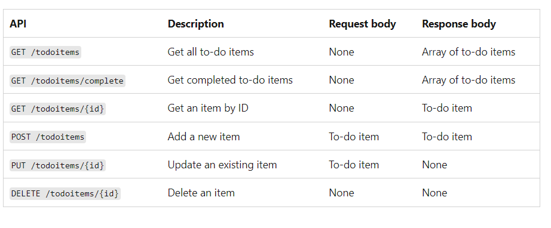
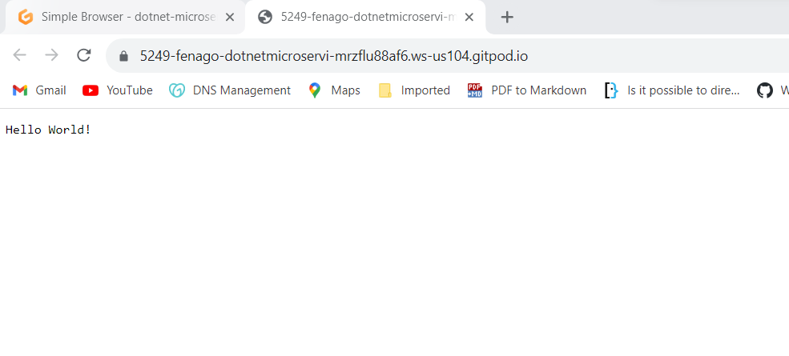
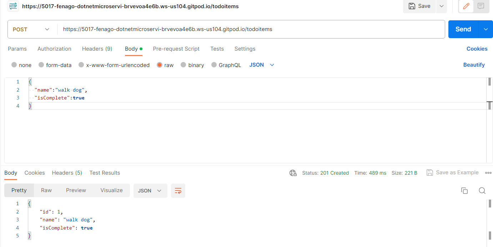
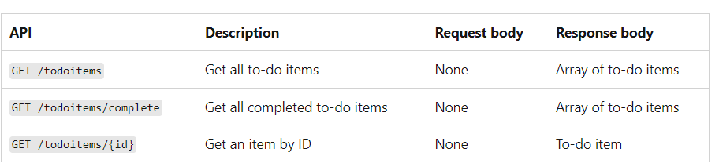

Lab: Create a minimal API with ASP.NET Core
============================================


In this lab
---------------

1.  Overview
2.  Prerequisites
3.  Create an API
    project
4.  Add NuGet
    packages
5.  The model and database context
    classes
6.  Add the API
    code
7.  Install Postman to test the
    app
8.  Examine the GET
    endpoints
9.  Test the GET
    endpoints
10. Return
    values
11. Examine the PUT
    endpoint
12. Test the PUT
    endpoint
13. Examine and test the DELETE
    endpoint
14. Use the MapGroup
    API
15. Use the TypedResults
    API
16. Prevent
    over-posting


Minimal APIs are architected to create HTTP APIs with minimal
dependencies. They are ideal for microservices and apps that want to
include only the minimum files, features, and dependencies in ASP.NET
Core.

This lab teaches the basics of building a minimal API with ASP.NET
Core. Another approach to creating APIs in ASP.NET Core is to use
controllers.


Overview
--------

This lab creates the following API:





Prerequisites
-------------

All pre-requisites have been installed already.


Create an API project
---------------------


-   Open the integrated terminal.

-   Change directories (`cd`) to the folder that will contain the
    project folder.

-   Run the following commands:


    ``` 
    dotnet new web -o TodoApi
    cd TodoApi
    ```

-   When a dialog box asks if you want to add required assets to the
    project, select **Yes**.

    The preceding commands create a new web minimal API project.


### Examine the code

The `Program.cs` file contains the following code:

``` 
var builder = WebApplication.CreateBuilder(args);
var app = builder.Build();

app.MapGet("/", () => "Hello World!");

app.Run();
```

The preceding code:

-   Creates a
    [WebApplicationBuilder]
    and a
    [WebApplication]
    with preconfigured defaults.
-   Creates an HTTP GET endpoint `/` that returns `Hello World!`:


#### Run the app

In your terminal, run the following command:


``` 
dotnet run
```

You should see an output similar to the following:


``` 
Building...
info: Microsoft.Hosting.Lifetime[14]
      Now listening on: http://YOUR_GITPOD_URL:5111
info: Microsoft.Hosting.Lifetime[0]
      Application started. Press Ctrl+C to shut down.
info: Microsoft.Hosting.Lifetime[0]
      Hosting environment: Development
info: Microsoft.Hosting.Lifetime[0]
      Content root path: /workspace/dotnet-microservices/TodoApi
warn: Microsoft.AspNetCore.HttpsPolicy.HttpsRedirectionMiddleware[3]
```


Wait for the app to display that it\'s listening and then open a browser and
navigate to `https://PORT-YOUR_GITPOD_URL.gitpod.io`

In this exercise, it showed that it was listening on port `5111` and it might be **differnet port** for you, so the following image shows the URL `https://PORT-YOUR_GITPOD_URL.gitpod.io/WeatherForecast`.




`Hello World!` is displayed in the browser. The `Program.cs` file
contains a minimal but complete app.

Add NuGet packages
------------------


NuGet packages must be added to support the database and diagnostics
used in this lab.

-   Run the following commands:

    ``` 
    dotnet add package Microsoft.EntityFrameworkCore.InMemory
    dotnet add package Microsoft.AspNetCore.Diagnostics.EntityFrameworkCore
    ```

**Note:** Run `export PATH="$PATH:/home/gitpod/.dotnet/tools"` command in the terminal if you get an error.


The model and database context classes
--------------------------------------


In the project folder, create a file named `Todo.cs` with the following
code:


``` 
public class Todo
{
    public int Id { get; set; }
    public string? Name { get; set; }
    public bool IsComplete { get; set; }
}
```

The preceding code creates the model for this app. A *model* is a class
that represents data that the app manages.

Create a file named `TodoDb.cs` with the following code:


``` 
using Microsoft.EntityFrameworkCore;

class TodoDb : DbContext
{
    public TodoDb(DbContextOptions<TodoDb> options)
        : base(options) { }

    public DbSet<Todo> Todos => Set<Todo>();
}
```

The preceding code defines the *database context*, which is the main
class that coordinates [Entity
Framework] functionality for
a data model. This class derives from the
[Microsoft.EntityFrameworkCore.DbContext]
class.

Add the API code
----------------

Replace the contents of the `Program.cs` file with the following code:


``` 
using Microsoft.EntityFrameworkCore;

var builder = WebApplication.CreateBuilder(args);
builder.Services.AddDbContext<TodoDb>(opt => opt.UseInMemoryDatabase("TodoList"));
builder.Services.AddDatabaseDeveloperPageExceptionFilter();
var app = builder.Build();

app.MapGet("/todoitems", async (TodoDb db) =>
    await db.Todos.ToListAsync());

app.MapGet("/todoitems/complete", async (TodoDb db) =>
    await db.Todos.Where(t => t.IsComplete).ToListAsync());

app.MapGet("/todoitems/{id}", async (int id, TodoDb db) =>
    await db.Todos.FindAsync(id)
        is Todo todo
            ? Results.Ok(todo)
            : Results.NotFound());

app.MapPost("/todoitems", async (Todo todo, TodoDb db) =>
{
    db.Todos.Add(todo);
    await db.SaveChangesAsync();

    return Results.Created($"/todoitems/{todo.Id}", todo);
});

app.MapPut("/todoitems/{id}", async (int id, Todo inputTodo, TodoDb db) =>
{
    var todo = await db.Todos.FindAsync(id);

    if (todo is null) return Results.NotFound();

    todo.Name = inputTodo.Name;
    todo.IsComplete = inputTodo.IsComplete;

    await db.SaveChangesAsync();

    return Results.NoContent();
});

app.MapDelete("/todoitems/{id}", async (int id, TodoDb db) =>
{
    if (await db.Todos.FindAsync(id) is Todo todo)
    {
        db.Todos.Remove(todo);
        await db.SaveChangesAsync();
        return Results.NoContent();
    }

    return Results.NotFound();
});

app.Run();
```

The following highlighted code adds the database context to the
[dependency injection
(DI)]
container and enables displaying database-related exceptions:


``` 
var builder = WebApplication.CreateBuilder(args);
builder.Services.AddDbContext<TodoDb>(opt => opt.UseInMemoryDatabase("TodoList"));
builder.Services.AddDatabaseDeveloperPageExceptionFilter();
var app = builder.Build();
```

The DI container provides access to the database context and other
services.


This lab uses Postman to test the API.

Install Postman to test the app
-------------------------------


-   Install [Postman](https://www.getpostman.com/downloads/) in your workstation. You can use any other tool as well.
-   Start the web app.
-   Start Postman.
-   Select **Workspaces** \> **Create Workspace** and then select
    **Next**.
-   Name the workspace *TodoApi* and select **Create**.
-   Disable **SSL certificate verification** if you get SSL certificate error.


Test posting data

-----------------


The following code in `Program.cs` creates an HTTP POST endpoint
`/todoitems` that adds data to the in-memory database:


``` 
app.MapPost("/todoitems", async (Todo todo, TodoDb db) =>
{
    db.Todos.Add(todo);
    await db.SaveChangesAsync();

    return Results.Created($"/todoitems/{todo.Id}", todo);
});
```

Run the app. The browser displays a 404 error because there is no longer
a `/` endpoint.

Use the POST endpoint to add data to the app.

-   In Postman, create a new HTTP request by selecting **New** \>
    **HTTP**.

-   Set the HTTP method to `POST`.

-   Set the URI to `https://PORT-YOUR_GITPOD_URL.gitpod.io/todoitems`.

-   Select the **Body** tab.

-   Select **raw**.

-   Set the type to **JSON**.

-   In the request body enter JSON for a to-do item:


    

    ``` 
    {
      "name":"walk dog",
      "isComplete":true
    }
    ```

-   Select **Send**.

    


Examine the GET endpoints

-------------------------


The sample app implements several GET endpoints by calling `MapGet`:





``` 
app.MapGet("/todoitems", async (TodoDb db) =>
    await db.Todos.ToListAsync());

app.MapGet("/todoitems/complete", async (TodoDb db) =>
    await db.Todos.Where(t => t.IsComplete).ToListAsync());

app.MapGet("/todoitems/{id}", async (int id, TodoDb db) =>
    await db.Todos.FindAsync(id)
        is Todo todo
            ? Results.Ok(todo)
            : Results.NotFound());
```

Test the GET endpoints
----------------------


Test the app by calling the endpoints from a browser or Postman. The
following steps are for Postman.

-   Create a new HTTP request.
-   Set the HTTP method to **GET**.
-   Set the request URI to `https://PORT-YOUR_GITPOD_URL.gitpod.io/todoitems`. For
    example, `https://YOUR_GITPOD_URL:5001/todoitems`.
-   Select **Send**.

The call to `GET /todoitems` produces a response similar to the
following:


``` 
[
  {
    "id": 1,
    "name": "walk dog",
    "isComplete": false
  }
]
```

-   Set the request URI to `https://PORT-YOUR_GITPOD_URL.gitpod.io/todoitems/1`. For
    example, `https://YOUR_GITPOD_URL:5001/todoitems/1`.

-   Select **Send**.

-   The response is similar to the following:


    

    ``` 
    {
      "id": 1,
      "name": "walk dog",
      "isComplete": false
    }
    ```


This app uses an in-memory database. If the app is restarted, the GET
request doesn\'t return any data. If no data is returned,
[POST
data to the app and try the GET request again.
Return values

-------------


ASP.NET Core automatically serializes the object to
[JSON](https://www.json.org/) and writes the JSON into the body of the
response message. The response code for this return type is [200
OK](https://developer.mozilla.org/docs/Web/HTTP/Status/200), assuming
there are no unhandled exceptions. Unhandled exceptions are translated
into 5xx errors.

The return types can represent a wide range of HTTP status codes. For
example, `GET /todoitems/{id}` can return two different status values:

-   If no item matches the requested ID, the method returns a [404
    status](https://developer.mozilla.org/docs/Web/HTTP/Status/404)
    [NotFound]
    error code.
-   Otherwise, the method returns 200 with a JSON response body.
    Returning `item` results in an HTTP 200 response.


Examine the PUT endpoint
------------------------

The sample app implements a single PUT endpoint using `MapPut`:


``` 
app.MapPut("/todoitems/{id}", async (int id, Todo inputTodo, TodoDb db) =>
{
    var todo = await db.Todos.FindAsync(id);

    if (todo is null) return Results.NotFound();

    todo.Name = inputTodo.Name;
    todo.IsComplete = inputTodo.IsComplete;

    await db.SaveChangesAsync();

    return Results.NoContent();
});
```

This method is similar to the `MapPost` method, except it uses HTTP PUT.
A successful response returns [204 (No
Content)](https://www.rfc-editor.org/rfc/rfc9110#status.204). According
to the HTTP specification, a PUT request requires the client to send the
entire updated entity, not just the changes. To support partial updates,
use [HTTP
PATCH].

Test the PUT endpoint
---------------------


This sample uses an in-memory database that must be initialized each
time the app is started. There must be an item in the database before
you make a PUT call. Call GET to ensure there\'s an item in the database
before making a PUT call.

Update the to-do item that has Id = 1 and set its name to `"feed fish"`.


Use Postman to send a PUT request:

-   Set the method to PUT.

-   Set the URI of the object to update (for example
    `https://PORT-YOUR_GITPOD_URL/todoitems/1`).

-   Set the body to the following JSON:

    ``` 
    {
      "id": 1,
      "name": "feed fish",
      "isComplete": false
    }
    ```

-   Select **Send**.


Examine and test the DELETE endpoint
------------------------------------

The sample app implements a single DELETE endpoint using `MapDelete`:


``` 
app.MapDelete("/todoitems/{id}", async (int id, TodoDb db) =>
{
    if (await db.Todos.FindAsync(id) is Todo todo)
    {
        db.Todos.Remove(todo);
        await db.SaveChangesAsync();
        return Results.NoContent();
    }

    return Results.NotFound();
});
```


Use Postman to delete a to-do item:

-   Set the method to `DELETE`.
-   Set the URI of the object to delete (for example
    `https://PORT-YOUR_GITPOD_URL/todoitems/1`).
-   Select **Send**.


Use the MapGroup API
--------------------


The sample app code repeats the `todoitems` URL prefix each time it sets
up an endpoint. APIs often have groups of endpoints with a common URL
prefix, and the
[MapGroup]
method is available to help organize such groups. It reduces repetitive
code and allows for customizing entire groups of endpoints with a single
call to methods like
[RequireAuthorization]
and
[WithMetadata].

Replace the contents of `Program.cs` with the following code:


``` 
using Microsoft.EntityFrameworkCore;

var builder = WebApplication.CreateBuilder(args);
builder.Services.AddDbContext<TodoDb>(opt => opt.UseInMemoryDatabase("TodoList"));
builder.Services.AddDatabaseDeveloperPageExceptionFilter();
var app = builder.Build();

var todoItems = app.MapGroup("/todoitems");

todoItems.MapGet("/", async (TodoDb db) =>
    await db.Todos.ToListAsync());

todoItems.MapGet("/complete", async (TodoDb db) =>
    await db.Todos.Where(t => t.IsComplete).ToListAsync());

todoItems.MapGet("/{id}", async (int id, TodoDb db) =>
    await db.Todos.FindAsync(id)
        is Todo todo
            ? Results.Ok(todo)
            : Results.NotFound());

todoItems.MapPost("/", async (Todo todo, TodoDb db) =>
{
    db.Todos.Add(todo);
    await db.SaveChangesAsync();

    return Results.Created($"/todoitems/{todo.Id}", todo);
});

todoItems.MapPut("/{id}", async (int id, Todo inputTodo, TodoDb db) =>
{
    var todo = await db.Todos.FindAsync(id);

    if (todo is null) return Results.NotFound();

    todo.Name = inputTodo.Name;
    todo.IsComplete = inputTodo.IsComplete;

    await db.SaveChangesAsync();

    return Results.NoContent();
});

todoItems.MapDelete("/{id}", async (int id, TodoDb db) =>
{
    if (await db.Todos.FindAsync(id) is Todo todo)
    {
        db.Todos.Remove(todo);
        await db.SaveChangesAsync();
        return Results.NoContent();
    }

    return Results.NotFound();
});

app.Run();
```

The preceding code has the following changes:

-   Adds `var todoItems = app.MapGroup("/todoitems");` to set up the
    group using the URL prefix `/todoitems`.
-   Changes all the `app.Map<HttpVerb>` methods to
    `todoItems.Map<HttpVerb>`.
-   Removes the URL prefix `/todoitems` from the `Map<HttpVerb>` method
    calls.

Test the endpoints to verify that they work the same.
Use the TypedResults API

------------------------


Returning
[TypedResults]
rather than
[Results]
has several advantages, including testability and automatically
returning the response type metadata for OpenAPI to describe the
endpoint. For more information, see [TypedResults vs
Results].

The `Map<HttpVerb>` methods can call route handler methods instead of
using lambdas. To see an example, update *Program.cs* with the following
code:


``` 
using Microsoft.EntityFrameworkCore;

var builder = WebApplication.CreateBuilder(args);
builder.Services.AddDbContext<TodoDb>(opt => opt.UseInMemoryDatabase("TodoList"));
builder.Services.AddDatabaseDeveloperPageExceptionFilter();
var app = builder.Build();

var todoItems = app.MapGroup("/todoitems");

todoItems.MapGet("/", GetAllTodos);
todoItems.MapGet("/complete", GetCompleteTodos);
todoItems.MapGet("/{id}", GetTodo);
todoItems.MapPost("/", CreateTodo);
todoItems.MapPut("/{id}", UpdateTodo);
todoItems.MapDelete("/{id}", DeleteTodo);

app.Run();

static async Task<IResult> GetAllTodos(TodoDb db)
{
    return TypedResults.Ok(await db.Todos.ToArrayAsync());
}

static async Task<IResult> GetCompleteTodos(TodoDb db)
{
    return TypedResults.Ok(await db.Todos.Where(t => t.IsComplete).ToListAsync());
}

static async Task<IResult> GetTodo(int id, TodoDb db)
{
    return await db.Todos.FindAsync(id)
        is Todo todo
            ? TypedResults.Ok(todo)
            : TypedResults.NotFound();
}

static async Task<IResult> CreateTodo(Todo todo, TodoDb db)
{
    db.Todos.Add(todo);
    await db.SaveChangesAsync();

    return TypedResults.Created($"/todoitems/{todo.Id}", todo);
}

static async Task<IResult> UpdateTodo(int id, Todo inputTodo, TodoDb db)
{
    var todo = await db.Todos.FindAsync(id);

    if (todo is null) return TypedResults.NotFound();

    todo.Name = inputTodo.Name;
    todo.IsComplete = inputTodo.IsComplete;

    await db.SaveChangesAsync();

    return TypedResults.NoContent();
}

static async Task<IResult> DeleteTodo(int id, TodoDb db)
{
    if (await db.Todos.FindAsync(id) is Todo todo)
    {
        db.Todos.Remove(todo);
        await db.SaveChangesAsync();
        return TypedResults.NoContent();
    }

    return TypedResults.NotFound();
}
```

The `Map<HttpVerb>` code now calls methods instead of lambdas:


``` 
var todoItems = app.MapGroup("/todoitems");

todoItems.MapGet("/", GetAllTodos);
todoItems.MapGet("/complete", GetCompleteTodos);
todoItems.MapGet("/{id}", GetTodo);
todoItems.MapPost("/", CreateTodo);
todoItems.MapPut("/{id}", UpdateTodo);
todoItems.MapDelete("/{id}", DeleteTodo);
```

These methods return objects that implement
[IResult]
and are defined by
[TypedResults]:


``` 
static async Task<IResult> GetAllTodos(TodoDb db)
{
    return TypedResults.Ok(await db.Todos.ToArrayAsync());
}

static async Task<IResult> GetCompleteTodos(TodoDb db)
{
    return TypedResults.Ok(await db.Todos.Where(t => t.IsComplete).ToListAsync());
}

static async Task<IResult> GetTodo(int id, TodoDb db)
{
    return await db.Todos.FindAsync(id)
        is Todo todo
            ? TypedResults.Ok(todo)
            : TypedResults.NotFound();
}

static async Task<IResult> CreateTodo(Todo todo, TodoDb db)
{
    db.Todos.Add(todo);
    await db.SaveChangesAsync();

    return TypedResults.Created($"/todoitems/{todo.Id}", todo);
}

static async Task<IResult> UpdateTodo(int id, Todo inputTodo, TodoDb db)
{
    var todo = await db.Todos.FindAsync(id);

    if (todo is null) return TypedResults.NotFound();

    todo.Name = inputTodo.Name;
    todo.IsComplete = inputTodo.IsComplete;

    await db.SaveChangesAsync();

    return TypedResults.NoContent();
}

static async Task<IResult> DeleteTodo(int id, TodoDb db)
{
    if (await db.Todos.FindAsync(id) is Todo todo)
    {
        db.Todos.Remove(todo);
        await db.SaveChangesAsync();
        return TypedResults.NoContent();
    }

    return TypedResults.NotFound();
}
```

Unit tests can call these methods and test that they return the correct
type. For example, if the method is `GetAllTodos`:


``` 
static async Task<IResult> GetAllTodos(TodoDb db)
{
    return TypedResults.Ok(await db.Todos.ToArrayAsync());
}
```

Unit test code can verify that an object of type
[Ok\<Todo\[\]\>]
is returned from the handler method. For example:


``` 
public async Task GetAllTodos_ReturnsOkOfTodosResult()
{
    // Arrange
    var db = CreateDbContext();

    // Act
    var result = await TodosApi.GetAllTodos(db);

    // Assert: Check for the correct returned type
    Assert.IsType<Ok<Todo[]>>(result);
}
```


Prevent over-posting
--------------------


Currently the app exposes the entire `Todo` object. Production
apps typically limit the data that\'s input and returned using a subset
of the model. There are multiple reasons behind this and security is a
major one. The subset of a model is usually referred to as a Data
Transfer Object (DTO), input model, or view model. **DTO** is used in
this article.

A DTO may be used to:

-   Prevent over-posting.
-   Hide properties that clients are not supposed to view.
-   Omit some properties in order to reduce payload size.
-   Flatten object graphs that contain nested objects. Flattened object
    graphs can be more convenient for clients.

To demonstrate the DTO approach, update the `Todo` class to include a
secret field:


``` 
public class Todo
{
    public int Id { get; set; }
    public string? Name { get; set; }
    public bool IsComplete { get; set; }
    public string? Secret { get; set; }
}
```

The secret field needs to be hidden from this app, but an administrative
app could choose to expose it.

Verify you can post and get the secret field.

Create a file named `TodoItemDTO.cs` with the following code:


``` 
public class TodoItemDTO
{
    public int Id { get; set; }
    public string? Name { get; set; }
    public bool IsComplete { get; set; }

    public TodoItemDTO() { }
    public TodoItemDTO(Todo todoItem) =>
    (Id, Name, IsComplete) = (todoItem.Id, todoItem.Name, todoItem.IsComplete);
}
```

Update the code in `Program.cs` to use this DTO model:


``` 
using Microsoft.EntityFrameworkCore;

var builder = WebApplication.CreateBuilder(args);
builder.Services.AddDbContext<TodoDb>(opt => opt.UseInMemoryDatabase("TodoList"));
builder.Services.AddDatabaseDeveloperPageExceptionFilter();
var app = builder.Build();

RouteGroupBuilder todoItems = app.MapGroup("/todoitems");

todoItems.MapGet("/", GetAllTodos);
todoItems.MapGet("/complete", GetCompleteTodos);
todoItems.MapGet("/{id}", GetTodo);
todoItems.MapPost("/", CreateTodo);
todoItems.MapPut("/{id}", UpdateTodo);
todoItems.MapDelete("/{id}", DeleteTodo);

app.Run();

static async Task<IResult> GetAllTodos(TodoDb db)
{
    return TypedResults.Ok(await db.Todos.Select(x => new TodoItemDTO(x)).ToArrayAsync());
}

static async Task<IResult> GetCompleteTodos(TodoDb db) {
    return TypedResults.Ok(await db.Todos.Where(t => t.IsComplete).Select(x => new TodoItemDTO(x)).ToListAsync());
}

static async Task<IResult> GetTodo(int id, TodoDb db)
{
    return await db.Todos.FindAsync(id)
        is Todo todo
            ? TypedResults.Ok(new TodoItemDTO(todo))
            : TypedResults.NotFound();
}

static async Task<IResult> CreateTodo(TodoItemDTO todoItemDTO, TodoDb db)
{
    var todoItem = new Todo
    {
        IsComplete = todoItemDTO.IsComplete,
        Name = todoItemDTO.Name
    };

    db.Todos.Add(todoItem);
    await db.SaveChangesAsync();

    todoItemDTO = new TodoItemDTO(todoItem);

    return TypedResults.Created($"/todoitems/{todoItem.Id}", todoItemDTO);
}

static async Task<IResult> UpdateTodo(int id, TodoItemDTO todoItemDTO, TodoDb db)
{
    var todo = await db.Todos.FindAsync(id);

    if (todo is null) return TypedResults.NotFound();

    todo.Name = todoItemDTO.Name;
    todo.IsComplete = todoItemDTO.IsComplete;

    await db.SaveChangesAsync();

    return TypedResults.NoContent();
}

static async Task<IResult> DeleteTodo(int id, TodoDb db)
{
    if (await db.Todos.FindAsync(id) is Todo todo)
    {
        db.Todos.Remove(todo);
        await db.SaveChangesAsync();
        return TypedResults.NoContent();
    }

    return TypedResults.NotFound();
}
```

Verify you can post and get all fields except the secret field.