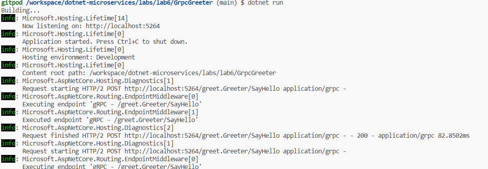

Lab: Create gRPC client and server Microservice
===============================================


In this lab
---------------

1.  Prerequisites
2.  Create a gRPC
    service
3.  Create the gRPC client in a .NET console
    app
4.  Test the gRPC client with the gRPC Greeter
    service


This lab shows how to create a .NET Core
[gRPC]
client and an ASP.NET Core gRPC Server. At the end, you\'ll have a gRPC
client that communicates with the gRPC Greeter service.

In this lab, you:

-   Create a gRPC Server.
-   Create a gRPC client.
-   Test the gRPC client with the gRPC Greeter service.


Create a gRPC service
---------------------

-   Open the integrated terminal.

-   Change to the directory (`cd`) that will contain the project.

-   Run the following commands:


    ``` 
    dotnet new grpc -o GrpcGreeter

    cd GrpcGreeter
    ```

    -   The `dotnet new` command creates a new gRPC service in the
        *GrpcGreeter* folder.
    -   Open the *GrpcGreeter* folder in the code editor.


### Run the service

In your terminal, run the following command:


``` 
dotnet run
```

You should see an output similar to the following:


``` 
info: Microsoft.Hosting.Lifetime[0]
      Now listening on: https://PORT-YOUR_GITPOD_URL.gitpod.io
info: Microsoft.Hosting.Lifetime[0]
      Application started. Press Ctrl+C to shut down.
info: Microsoft.Hosting.Lifetime[0]
      Hosting environment: Development
```


The logs show the service listening on `https://PORT-YOUR_GITPOD_URL.gitpod.io`, where
`<port>` is the localhost port number randomly assigned when the project
is created and set in `Properties/launchSettings.json`.


### Examine the project files


*GrpcGreeter* project files:

-   `Protos/greet.proto`: defines the `Greeter` gRPC and is used to
    generate the gRPC server assets. For more information, see
    [Introduction to
    gRPC].
-   `Services` folder: Contains the implementation of the `Greeter`
    service.
-   `appSettings.json`: Contains configuration data such as the protocol
    used by Kestrel. For more information, see [Configuration in ASP.NET
    Core].
-   `Program.cs`, which contains:
    -   The entry point for the gRPC service. For more information, see
        [.NET Generic Host in ASP.NET
        Core].
    -   Code that configures app behavior. For more information, see
        [App
        startup].


Create the gRPC client in a .NET console app
--------------------------------------------


-   Open another integrated terminal.

-   Change directories (`cd`) to a folder for the project.

-   Run the following commands:


    ``` 
    dotnet new console -o GrpcGreeterClient

    cd GrpcGreeterClient
    ```


### Add required NuGet packages

The gRPC client project requires the following NuGet packages:

- `Grpc.Net.Client`, which contains the .NET Core client.
- `Google.Protobuf`, which contains protobuf message APIs for C#.
- `Grpc.Tools`, which contain C# tooling support for protobuf files. The tooling package isn't required at runtime, so the dependency is marked with PrivateAssets="All".

Run the following commands from the **Integrated Terminal**:


``` 
dotnet add GrpcGreeterClient.csproj package Grpc.Net.Client
dotnet add GrpcGreeterClient.csproj package Google.Protobuf
dotnet add GrpcGreeterClient.csproj package Grpc.Tools
```


-   Right-click **GrpcGreeterClient** project in the **Solution Pad**
    and select **Manage NuGet Packages**.
-   Enter **Grpc.Net.Client** in the search box.
-   Select the **Grpc.Net.Client** package from the results pane and
    select **Add Package**.
-   In **Select Projects** select **OK**.
-   If the **License Acceptance** dialog appears, select **Accept** if
    you agree to the license terms.
-   Repeat for `Google.Protobuf` and `Grpc.Tools`.


### Add greet.proto


-   Create a *Protos* folder in the gRPC client project.

-   Copy the *Protos\\greet.proto* file from the gRPC Greeter service to
    the *Protos* folder in the gRPC client project.

-   Update the namespace inside the `greet.proto` file to the project\'s
    namespace:


    ``` 
    option csharp_namespace = "GrpcGreeterClient";
    ```

-   Edit the `GrpcGreeterClient.csproj` project file:


Select the `GrpcGreeterClient.csproj` file.


-   Add an item group with a `<Protobuf>` element that refers to the
    *greet.proto* file:


    ``` 
    <ItemGroup>
      <Protobuf Include="Protos\greet.proto" GrpcServices="Client" />
    </ItemGroup>
    ```


### Create the Greeter client


-   Build the client project to create the types in the
    `GrpcGreeterClient` namespace.


``` 
dotnet build
```


**Note**

The `GrpcGreeterClient` types are generated automatically by the build
process. The tooling package
[Grpc.Tools](https://www.nuget.org/packages/Grpc.Tools/) generates the
following files based on the *greet.proto* file:

-   `GrpcGreeterClient\obj\Debug\[TARGET_FRAMEWORK]\Protos\Greet.cs`:
    The protocol buffer code which populates, serializes and retrieves
    the request and response message types.

-   `GrpcGreeterClient\obj\Debug\[TARGET_FRAMEWORK]\Protos\GreetGrpc.cs`:
    Contains the generated client classes.

-   Update the gRPC client `Program.cs` file with the following code.


    ``` 
    using System.Threading.Tasks;
    using Grpc.Net.Client;
    using GrpcGreeterClient;

    // The port number must match the port of the gRPC server.
    using var channel = GrpcChannel.ForAddress("http://localhost:UPDATE_PORT");
    var client = new Greeter.GreeterClient(channel);
    var reply = await client.SayHelloAsync(
                      new HelloRequest { Name = "GreeterClient" });
    Console.WriteLine("Greeting: " + reply.Message);
    Console.WriteLine("Press any key to exit...");
    Console.ReadKey();
    ```

-   In the preceding highlighted code, replace the localhost port number
    with the `HTTP` port number specified in
    `Properties/launchSettings.json` within the `GrpcGreeter` service
    project.


`Program.cs` contains the entry point and logic for the gRPC client.

The Greeter client is created by:

-   Instantiating a `GrpcChannel` containing the information for
    creating the connection to the gRPC service.
-   Using the `GrpcChannel` to construct the Greeter client:


``` 
// The port number must match the port of the gRPC server.
using var channel = GrpcChannel.ForAddress("http://localhost:PORT");
var client = new Greeter.GreeterClient(channel);
var reply = await client.SayHelloAsync(
                  new HelloRequest { Name = "GreeterClient" });
Console.WriteLine("Greeting: " + reply.Message);
Console.WriteLine("Press any key to exit...");
Console.ReadKey();
```

The Greeter client calls the asynchronous `SayHello` method. The result
of the `SayHello` call is displayed:


``` 
// The port number must match the port of the gRPC server.
using var channel = GrpcChannel.ForAddress("http://localhost:PORT");
var client = new Greeter.GreeterClient(channel);
var reply = await client.SayHelloAsync(
                  new HelloRequest { Name = "GreeterClient" });
Console.WriteLine("Greeting: " + reply.Message);
Console.WriteLine("Press any key to exit...");
Console.ReadKey();
```


Test the gRPC client with the gRPC Greeter service
--------------------------------------------------


Update the `appsettings.Development.json` file by adding the following
highlighted lines:


``` 
{
  "Logging": {
    "LogLevel": {
      "Default": "Information",
      "Microsoft.AspNetCore": "Warning",
      "Microsoft.AspNetCore.Hosting": "Information",
      "Microsoft.AspNetCore.Routing.EndpointMiddleware": "Information"
    }
  }
}
```


-   Start the Greeter service from `GrpcGreeter` folder.

    `dotnet run`

-   Start the client from `GrpcGreeterClient` folder.

    `dotnet run`

The client sends a greeting to the service with a message containing its
name, *GreeterClient*. The service sends the message \"Hello
GreeterClient\" as a response. The \"Hello GreeterClient\" response is
displayed in the command prompt:


``` 
Greeting: Hello GreeterClient
Press any key to exit...
```


The gRPC service records the details of the successful call in the logs
written to the command prompt:




**Note:** Make sure to call a gRPC service in GreeterClient with `http`.

