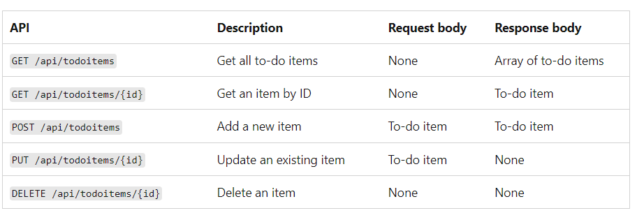
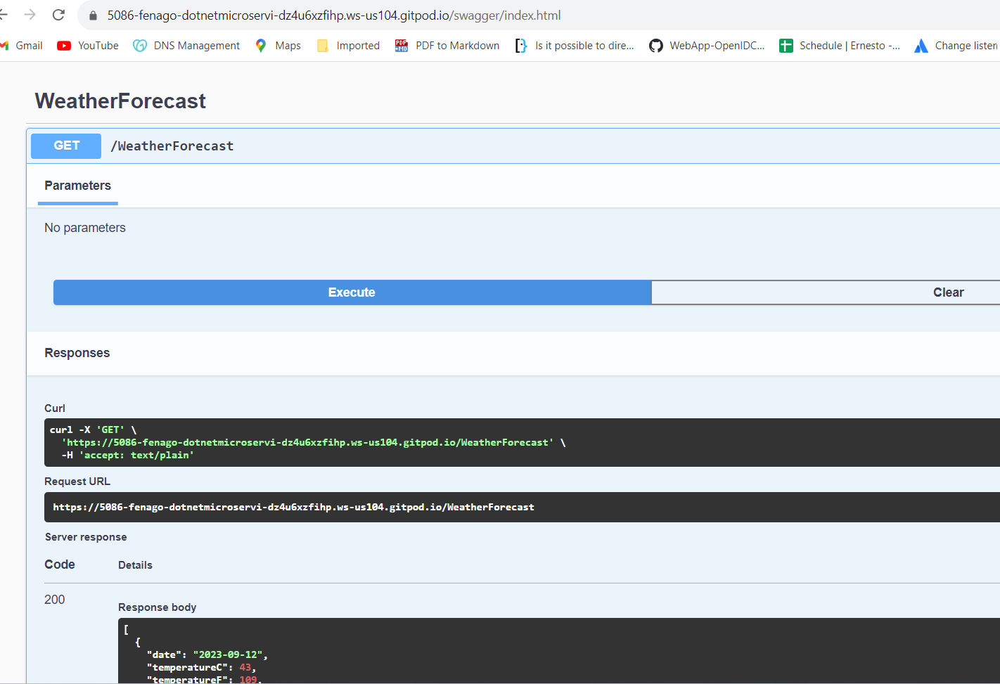

Lab: Create a web API with ASP.NET Core
=======================================


In this lab
---------------

1.  Overview
2.  Prerequisites
3.  Create a web
    project
4.  Add a model
    class
5.  Add a database
    context
6.  Add the TodoContext database
    context
7.  Register the database
    context
8.  Scaffold a
    controller
9.  Update the PostTodoItem create
    method
10. Examine the GET
    methods
11. Routing and URL
    paths
12. Return
    values
13. The PutTodoItem
    method
14. The DeleteTodoItem
    method
15. Test with Postman


This lab teaches the basics of building a controller-based web API
that uses a database. Another approach to creating APIs in ASP.NET Core
is to create *minimal APIs* which was done in Lab 2. 


Overview
--------

This lab creates the following API:




The following diagram shows the design of the app.


The client is represented by a box on the left. It submits a request
and receives a response from the application, a box drawn on the right.
Within the application box, three boxes represent the controller, the
model, and the data access layer. The request comes into the
application\'s controller, and read/write operations occur between the
controller and the data access layer. The model is serialized and
returned to the client in the response.


Create a web project
--------------------

-   Open the integrated terminal.

-   Change directories (`cd`) to the folder that will contain the project folder.

-   Run the following commands:

    ``` 
    dotnet new webapi -o TodoApi
    
    cd TodoApi

    dotnet add package Microsoft.EntityFrameworkCore.InMemory
    ```

    These commands:

    -   Create a new web API project and open it in Visual Studio Code.
    -   Add a NuGet package that is needed for the next section.


### Test the project

Run the app:

-   Run the following command to start the app on the `https` profile:


    ``` 
    dotnet run
    ```

The output shows messages similar to the following, indicating that the
app is running and awaiting requests:


``` 
...
info: Microsoft.Hosting.Lifetime[14]
      Now listening on: https://localhost:{port}
...
```

-   Ctrl]+*click* the HTTPS URL in the output to test the web app
    in a browser.

-   The default browser is launched to
    `https://PORT-YOUR_GITPOD_URL.gitpod.io/swagger/index.html`, where `<port>` is the
    randomly chosen port number displayed in the output. There is no
    endpoint at `https://PORT-YOUR_GITPOD_URL.gitpod.io`, so the browser returns [HTTP
    404 Not
    Found](https://developer.mozilla.org/docs/Web/HTTP/Status/404).
    Append `/swagger` to the URL, `https://PORT-YOUR_GITPOD_URL.gitpod.io/swagger`.

After testing the web app in the following instruction, press
[Ctrl]+[C] in the integrated terminal to shut it down.


The Swagger page `/swagger/index.html` is displayed. Select **GET** \>
**Try it out** \> **Execute**. The page displays:

-   The [Curl](https://curl.haxx.se/) command to test the
    WeatherForecast API.
-   The URL to test the WeatherForecast API.
-   The response code, body, and headers.
-   A drop-down list box with media types and the example value and
    schema.

Swagger is used to generate useful documentation and help pages for web
APIs. This lab uses Swagger to test the app. For more information
on Swagger, see [ASP.NET Core web API documentation with Swagger /
OpenAPI

Copy and paste the **Request URL** in the browser:
`https://PORT-YOUR_GITPOD_URL.gitpod.io/weatherforecast`

JSON similar to the following example is returned:


``` 
[
    {
        "date": "2019-07-16T19:04:05.7257911-06:00",
        "temperatureC": 52,
        "temperatureF": 125,
        "summary": "Mild"
    },
    {
        "date": "2019-07-17T19:04:05.7258461-06:00",
        "temperatureC": 36,
        "temperatureF": 96,
        "summary": "Warm"
    },
    {
        "date": "2019-07-18T19:04:05.7258467-06:00",
        "temperatureC": 39,
        "temperatureF": 102,
        "summary": "Cool"
    },
    {
        "date": "2019-07-19T19:04:05.7258471-06:00",
        "temperatureC": 10,
        "temperatureF": 49,
        "summary": "Bracing"
    },
    {
        "date": "2019-07-20T19:04:05.7258474-06:00",
        "temperatureC": -1,
        "temperatureF": 31,
        "summary": "Chilly"
    }
]
```




Add a model class
-----------------


A *model* is a set of classes that represent the data that the app
manages. The model for this app is the `TodoItem` class.


-   Add a folder named `Models`.
-   Add a `TodoItem.cs` file to the `Models` folder with the following
    code:


``` 
namespace TodoApi.Models;

public class TodoItem
{
    public long Id { get; set; }
    public string? Name { get; set; }
    public bool IsComplete { get; set; }
}
```

The `Id` property functions as the unique key in a relational database.

Model classes can go anywhere in the project, but the `Models` folder is
used by convention.

Add a database context
----------------------


The *database context* is the main class that coordinates Entity
Framework functionality for a data model. This class is created by
deriving from the
[Microsoft.EntityFrameworkCore.DbContext]
class.


-   Add a `TodoContext.cs` file to the `Models` folder.

-   Enter the following code: 

    ``` 
    using Microsoft.EntityFrameworkCore;

    namespace TodoApi.Models;

    public class TodoContext : DbContext
    {
        public TodoContext(DbContextOptions<TodoContext> options)
            : base(options)
        {
        }

        public DbSet<TodoItem> TodoItems { get; set; } = null!;
    }
    ```

Register the database context
-----------------------------


In ASP.NET Core, services such as the DB context must be registered with
the [dependency injection
(DI)]
container. The container provides the service to controllers.

Update `Program.cs` with the following highlighted code:


``` 
using Microsoft.EntityFrameworkCore;
using TodoApi.Models;

var builder = WebApplication.CreateBuilder(args);

builder.Services.AddControllers();
builder.Services.AddDbContext<TodoContext>(opt =>
    opt.UseInMemoryDatabase("TodoList"));
builder.Services.AddEndpointsApiExplorer();
builder.Services.AddSwaggerGen();

var app = builder.Build();

if (app.Environment.IsDevelopment())
{
    app.UseSwagger();
    app.UseSwaggerUI();
}

app.UseHttpsRedirection();

app.UseAuthorization();

app.MapControllers();

app.Run();
```

The preceding code:

-   Adds `using` directives.
-   Adds the database context to the DI container.
-   Specifies that the database context will use an in-memory database.

Scaffold a controller
---------------------

Make sure that all of your changes so far are saved.

-   Control-click the **TodoAPI** project and select **Open in Terminal**. The terminal opens at the `TodoAPI` project folder. Run   the following commands:


``` 
dotnet add package Microsoft.VisualStudio.Web.CodeGeneration.Design -v 7.0.0
dotnet add package Microsoft.EntityFrameworkCore.Design -v 7.0.0
dotnet add package Microsoft.EntityFrameworkCore.SqlServer -v 7.0.0
dotnet tool uninstall -g dotnet-aspnet-codegenerator
dotnet tool install -g dotnet-aspnet-codegenerator
dotnet tool update -g dotnet-aspnet-codegenerator
```

**Note:** Run commands one by one and ignore not found errors while running uninstalling commands.


The preceding commands:

-   Add NuGet packages required for scaffolding.

-   Install the scaffolding engine (`dotnet-aspnet-codegenerator`) after
    uninstalling any possible previous version.


Build the project.

Run the following command:


``` 
dotnet aspnet-codegenerator controller -name TodoItemsController -async -api -m TodoItem -dc TodoContext -outDir Controllers
```

The preceding command scaffolds the `TodoItemsController`.


The generated code:

-   Marks the class with the
    [`[ApiController]`]
    attribute. This attribute indicates that the controller responds to
    web API requests. For information about specific behaviors that the
    attribute enables, see [Create web APIs with ASP.NET
    Core].
-   Uses DI to inject the database context (`TodoContext`) into the
    controller. The database context is used in each of the CRUD
    methods in the controller.

The ASP.NET Core templates for:

-   Controllers with views include `[action]` in the route template.
-   API controllers don\'t include `[action]` in the route template.

When the `[action]` token isn\'t in the route template, the
[action]
name (method name) isn\'t included in the endpoint. That is, the
action\'s associated method name isn\'t used in the matching route.


Update the PostTodoItem create method
-------------------------------------

Update the return statement in the `PostTodoItem` to use the
[nameof] operator:


``` 
[HttpPost]
public async Task<ActionResult<TodoItem>> PostTodoItem(TodoItem todoItem)
{
    _context.TodoItems.Add(todoItem);
    await _context.SaveChangesAsync();

    //    return CreatedAtAction("GetTodoItem", new { id = todoItem.Id }, todoItem);
    return CreatedAtAction(nameof(GetTodoItem), new { id = todoItem.Id }, todoItem);
}
```

The preceding code is an `HTTP POST` method, as indicated by the
[`[HttpPost]`]
attribute. The method gets the value of the `TodoItem` from the body of
the HTTP request.

For more information, see [Attribute routing with Http\[Verb\]
attributes].

The
[CreatedAtAction]
method:

-   Returns an [HTTP 201 status
    code](https://developer.mozilla.org/docs/Web/HTTP/Status/201) if
    successful. `HTTP 201` is the standard response for an `HTTP POST`
    method that creates a new resource on the server.

-   Adds a
    [Location](https://developer.mozilla.org/docs/Web/HTTP/Headers/Location)
    header to the response. The `Location` header specifies the
    [URI](https://developer.mozilla.org/docs/Glossary/URI) of the newly
    created to-do item.

-   References the `GetTodoItem` action to create the `Location`
    header\'s URI. The C\# `nameof` keyword is used to avoid hard-coding
    the action name in the `CreatedAtAction` call.


### Test PostTodoItem


-   Run following command in terminal to run the app:

    `dotnet run`

-   In the Swagger browser window, select **POST /api/TodoItems**, and
    then select **Try it out**.

-   In the **Request body** input window, update the JSON. For example,
  

    ``` 
    {
      "name": "walk dog",
      "isComplete": true
    }
    ```

-   Select **Execute**

    

### Test the location header URI


In the preceding POST, the Swagger UI shows the location header
under **Response headers**. For example,
`location: http://PORT-YOUR_GITPOD_URL.gitpod.io/api/TodoItems/1`. The location header
shows the URI to the created resource.

To test the location header:

-   In the Swagger browser window, select **GET /api/TodoItems/{id}**,
    and then select **Try it out**.

-   Enter `1` in the `id` input box, and then select **Execute**.

    
Examine the GET methods

-----------------------


Two GET endpoints are implemented:

-   `GET /api/todoitems`
-   `GET /api/todoitems/{id}`

The previous section showed an example of the `/api/todoitems/{id}`
route.

Follow the
[POST
instructions to add another todo item, and then test the
`/api/todoitems` route using Swagger.

This app uses an in-memory database. If the app is stopped and started,
the preceding GET request will not return any data. If no data is
returned, POST data to the app.


Routing and URL paths
---------------------


The
[`[HttpGet]`]
attribute denotes a method that responds to an `HTTP GET` request. The
URL path for each method is constructed as follows:

-   Start with the template string in the controller\'s `Route`
    attribute:

    

    ``` 
    [Route("api/[controller]")]
    [ApiController]
    public class TodoItemsController : ControllerBase
    ```

-   Replace `[controller]` with the name of the controller, which by
    convention is the controller class name minus the \"Controller\"
    suffix. For this sample, the controller class name is
    **TodoItems**Controller, so the controller name is \"TodoItems\".
    ASP.NET Core
    [routing]
    is case insensitive.

-   If the `[HttpGet]` attribute has a route template (for example,
    `[HttpGet("products")]`), append that to the path. This sample
    doesn\'t use a template. For more information, see [Attribute
    routing with Http\[Verb\]
    attributes].

In the following `GetTodoItem` method, `"{id}"` is a placeholder
variable for the unique identifier of the to-do item. When `GetTodoItem`
is invoked, the value of `"{id}"` in the URL is provided to the method
in its `id` parameter.


``` 
[HttpGet("{id}")]
public async Task<ActionResult<TodoItem>> GetTodoItem(long id)
{
    var todoItem = await _context.TodoItems.FindAsync(id);

    if (todoItem == null)
    {
        return NotFound();
    }

    return todoItem;
}
```

Return values
-------------


The return type of the `GetTodoItems` and `GetTodoItem` methods is
[ActionResult\<T\>
type].
ASP.NET Core automatically serializes the object to
`JSON` and writes the JSON into the body of the
response message. The response code for this return type is `200 OK`, assuming
there are no unhandled exceptions. Unhandled exceptions are translated
into 5xx errors.

`ActionResult` return types can represent a wide range of HTTP status
codes. For example, `GetTodoItem` can return two different status
values:

-   If no item matches the requested ID, the method returns a [404
    status](https://developer.mozilla.org/docs/Web/HTTP/Status/404)
    [NotFound]
    error code.
-   Otherwise, the method returns 200 with a JSON response body.
    Returning `item` results in an `HTTP 200` response.


The PutTodoItem method
----------------------


Examine the `PutTodoItem` method:


``` 
[HttpPut("{id}")]
public async Task<IActionResult> PutTodoItem(long id, TodoItem todoItem)
{
    if (id != todoItem.Id)
    {
        return BadRequest();
    }

    _context.Entry(todoItem).State = EntityState.Modified;

    try
    {
        await _context.SaveChangesAsync();
    }
    catch (DbUpdateConcurrencyException)
    {
        if (!TodoItemExists(id))
        {
            return NotFound();
        }
        else
        {
            throw;
        }
    }

    return NoContent();
}
```

`PutTodoItem` is similar to `PostTodoItem`, except it uses `HTTP PUT`.
The response is [204 (No
Content)](https://www.rfc-editor.org/rfc/rfc9110#status.204). According
to the HTTP specification, a `PUT` request requires the client to send
the entire updated entity, not just the changes. To support partial
updates, use **HTTP PATCH**.


### Test the PutTodoItem method


This sample uses an in-memory database that must be initialized each
time the app is started. There must be an item in the database before
you make a PUT call. Call GET to ensure there\'s an item in the database
before making a PUT call.

Using the Swagger UI, use the PUT button to update the `TodoItem` that
has Id = 1 and set its name to `"feed fish"`. Note the response is `HTTP 204 No Content`.


The DeleteTodoItem method
-------------------------


Examine the `DeleteTodoItem` method:


``` 
[HttpDelete("{id}")]
public async Task<IActionResult> DeleteTodoItem(long id)
{
    var todoItem = await _context.TodoItems.FindAsync(id);
    if (todoItem == null)
    {
        return NotFound();
    }

    _context.TodoItems.Remove(todoItem);
    await _context.SaveChangesAsync();

    return NoContent();
}
```


### Test the DeleteTodoItem method

Use the Swagger UI to delete the `TodoItem` that has Id = 1. Note the
response is `HTTP 204 No Content`.

Test with Postman
------------------

**Note:** You can test the APIs by installing Postman on your workstation and access dotnet app using gitpod URL.

- Install Postman.
- Start the web app.
- Start Postman.
- Disable SSL certificate verification if you get SSL certificate error.


**IMPORTANT:** We will calling these APIs using Javascript in the next lab. You can create copy of this labssolution for the next lab.