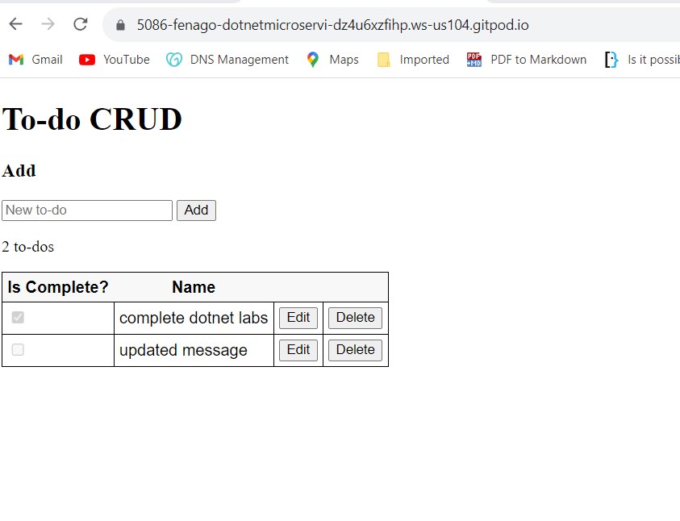

#### Lab: ASP.NET Core web API with JavaScript

In this lab, you'll add an HTML page containing forms for creating and managing to-do items. Event handlers are attached to elements on the page. The event handlers result in HTTP requests to the web API's action methods. The Fetch API's `fetch` function initiates each HTTP request.


**Prerequisites**

- Complete Previous Lab
- Familiarity with CSS, HTML, and JavaScript

**Note:** We will be making changes in the previous lab's solution.

**Call the web API with JavaScript**

The fetch function returns a Promise object, which contains an HTTP response represented as a Response object. A common pattern is to extract the JSON response body by invoking the json function on the Response object. JavaScript updates the page with the details from the web API's response.

The simplest fetch call accepts a single parameter representing the route. A second parameter, known as the `init` object, is optional. init is used to configure the HTTP request.

Configure the app to serve static files and enable default file mapping. Add the following code in `Program.cs`:


```
using Microsoft.EntityFrameworkCore;
using TodoApi.Models;

var builder = WebApplication.CreateBuilder(args);

builder.Services.AddControllers();
builder.Services.AddDbContext<TodoContext>(opt =>
    opt.UseInMemoryDatabase("TodoList"));

var app = builder.Build();

if (builder.Environment.IsDevelopment())
{
    app.UseDeveloperExceptionPage();
}

app.UseDefaultFiles();
app.UseStaticFiles();

app.UseHttpsRedirection();

app.UseAuthorization();

app.MapControllers();

app.Run();
```


1. Create a wwwroot folder in the project root.

2. Create a css folder inside of the wwwroot folder.

3. Create a js folder inside of the wwwroot folder.

4. Add an HTML file named `index.html` to the wwwroot folder. Replace the contents of index.html with the following markup:

```
<!DOCTYPE html>
<html>
<head>
    <meta charset="UTF-8">
    <title>To-do CRUD</title>
    <link rel="stylesheet" href="css/site.css" />
</head>
<body>
    <h1>To-do CRUD</h1>
    <h3>Add</h3>
    <form action="javascript:void(0);" method="POST" onsubmit="addItem()">
        <input type="text" id="add-name" placeholder="New to-do">
        <input type="submit" value="Add">
    </form>

    <div id="editForm">
        <h3>Edit</h3>
        <form action="javascript:void(0);" onsubmit="updateItem()">
            <input type="hidden" id="edit-id">
            <input type="checkbox" id="edit-isComplete">
            <input type="text" id="edit-name">
            <input type="submit" value="Save">
            <a onclick="closeInput()" aria-label="Close">&#10006;</a>
        </form>
    </div>

    <p id="counter"></p>

    <table>
        <tr>
            <th>Is Complete?</th>
            <th>Name</th>
            <th></th>
            <th></th>
        </tr>
        <tbody id="todos"></tbody>
    </table>

    <script src="js/site.js" asp-append-version="true"></script>
    <script type="text/javascript">
        getItems();
    </script>
</body>
</html>
```

5. Add a CSS file named `site.css` to the wwwroot/css folder. Replace the contents of `site.css` with the following styles:

```
input[type='submit'], button, [aria-label] {
    cursor: pointer;
}

#editForm {
    display: none;
}

table {
    font-family: Arial, sans-serif;
    border: 1px solid;
    border-collapse: collapse;
}

th {
    background-color: #f8f8f8;
    padding: 5px;
}

td {
    border: 1px solid;
    padding: 5px;
}
```

6. Add a JavaScript file named `site.js` to the wwwroot/js folder. Replace the contents of site.js with the following code:

```
const uri = 'api/todoitems';
let todos = [];

function getItems() {
  fetch(uri)
    .then(response => response.json())
    .then(data => _displayItems(data))
    .catch(error => console.error('Unable to get items.', error));
}

function addItem() {
  const addNameTextbox = document.getElementById('add-name');

  const item = {
    isComplete: false,
    name: addNameTextbox.value.trim()
  };

  fetch(uri, {
    method: 'POST',
    headers: {
      'Accept': 'application/json',
      'Content-Type': 'application/json'
    },
    body: JSON.stringify(item)
  })
    .then(response => response.json())
    .then(() => {
      getItems();
      addNameTextbox.value = '';
    })
    .catch(error => console.error('Unable to add item.', error));
}

function deleteItem(id) {
  fetch(`${uri}/${id}`, {
    method: 'DELETE'
  })
  .then(() => getItems())
  .catch(error => console.error('Unable to delete item.', error));
}

function displayEditForm(id) {
  const item = todos.find(item => item.id === id);
  
  document.getElementById('edit-name').value = item.name;
  document.getElementById('edit-id').value = item.id;
  document.getElementById('edit-isComplete').checked = item.isComplete;
  document.getElementById('editForm').style.display = 'block';
}

function updateItem() {
  const itemId = document.getElementById('edit-id').value;
  const item = {
    id: parseInt(itemId, 10),
    isComplete: document.getElementById('edit-isComplete').checked,
    name: document.getElementById('edit-name').value.trim()
  };

  fetch(`${uri}/${itemId}`, {
    method: 'PUT',
    headers: {
      'Accept': 'application/json',
      'Content-Type': 'application/json'
    },
    body: JSON.stringify(item)
  })
  .then(() => getItems())
  .catch(error => console.error('Unable to update item.', error));

  closeInput();

  return false;
}

function closeInput() {
  document.getElementById('editForm').style.display = 'none';
}

function _displayCount(itemCount) {
  const name = (itemCount === 1) ? 'to-do' : 'to-dos';

  document.getElementById('counter').innerText = `${itemCount} ${name}`;
}

function _displayItems(data) {
  const tBody = document.getElementById('todos');
  tBody.innerHTML = '';

  _displayCount(data.length);

  const button = document.createElement('button');

  data.forEach(item => {
    let isCompleteCheckbox = document.createElement('input');
    isCompleteCheckbox.type = 'checkbox';
    isCompleteCheckbox.disabled = true;
    isCompleteCheckbox.checked = item.isComplete;

    let editButton = button.cloneNode(false);
    editButton.innerText = 'Edit';
    editButton.setAttribute('onclick', `displayEditForm(${item.id})`);

    let deleteButton = button.cloneNode(false);
    deleteButton.innerText = 'Delete';
    deleteButton.setAttribute('onclick', `deleteItem(${item.id})`);

    let tr = tBody.insertRow();
    
    let td1 = tr.insertCell(0);
    td1.appendChild(isCompleteCheckbox);

    let td2 = tr.insertCell(1);
    let textNode = document.createTextNode(item.name);
    td2.appendChild(textNode);

    let td3 = tr.insertCell(2);
    td3.appendChild(editButton);

    let td4 = tr.insertCell(3);
    td4.appendChild(deleteButton);
  });

  todos = data;
}
```


A change to the ASP.NET Core project's launch settings may be required to test the HTML page locally:

1. Open `Properties\launchSettings.json`.
2. Remove the `launchUrl` property to force the app to open at `index.html` —the project's default file.


**Run Application**

In your terminal, run the following command:

``` 
dotnet run
```

Wait for the app to display that it\'s listening and then open a browser and
navigate to `https://PORT-YOUR_GITPOD_URL.gitpod.io`




This lab calls all of the CRUD methods of the web API. Following are explanations of the web API requests.


**Get a list of to-do items**

In the following code, an HTTP GET request is sent to the api/todoitems route:


```
fetch(uri)
  .then(response => response.json())
  .then(data => _displayItems(data))
  .catch(error => console.error('Unable to get items.', error));
```


When the web API returns a successful status code, the _displayItems function is invoked. Each to-do item in the array parameter accepted by _displayItems is added to a table with `Edit` and `Delete` buttons. If the web API request fails, an error is logged to the browser's console.


**Add a to-do item**

In the following code:

- An item variable is declared to construct an object literal representation of the to-do item.
- A Fetch request is configured with the following options:
    * method—specifies the POST HTTP action verb.
    * body—specifies the JSON representation of the request body. The JSON is produced by passing the object literal stored in item to the JSON.stringify function.
    * headers—specifies the Accept and Content-Type HTTP request headers. Both headers are set to application/json to specify the media type being received and sent, respectively.
- An HTTP POST request is sent to the api/todoitems route.

```
function addItem() {
  const addNameTextbox = document.getElementById('add-name');

  const item = {
    isComplete: false,
    name: addNameTextbox.value.trim()
  };

  fetch(uri, {
    method: 'POST',
    headers: {
      'Accept': 'application/json',
      'Content-Type': 'application/json'
    },
    body: JSON.stringify(item)
  })
    .then(response => response.json())
    .then(() => {
      getItems();
      addNameTextbox.value = '';
    })
    .catch(error => console.error('Unable to add item.', error));
}
```


When the web API returns a successful status code, the getItems function is invoked to update the HTML table. If the web API request fails, an error is logged to the browser's console.


**Update a to-do item**

Updating a to-do item is similar to adding one; however, there are two significant differences:

- The route is suffixed with the unique identifier of the item to update. For example, api/todoitems/1.
- The HTTP action verb is PUT, as indicated by the method option.

```
fetch(`${uri}/${itemId}`, {
  method: 'PUT',
  headers: {
    'Accept': 'application/json',
    'Content-Type': 'application/json'
  },
  body: JSON.stringify(item)
})
.then(() => getItems())
.catch(error => console.error('Unable to update item.', error));
```

**Delete a to-do item**

To delete a to-do item, set the request's method option to DELETE and specify the item's unique identifier in the URL.

```
fetch(`${uri}/${id}`, {
  method: 'DELETE'
})
.then(() => getItems())
.catch(error => console.error('Unable to delete item.', error));
```


