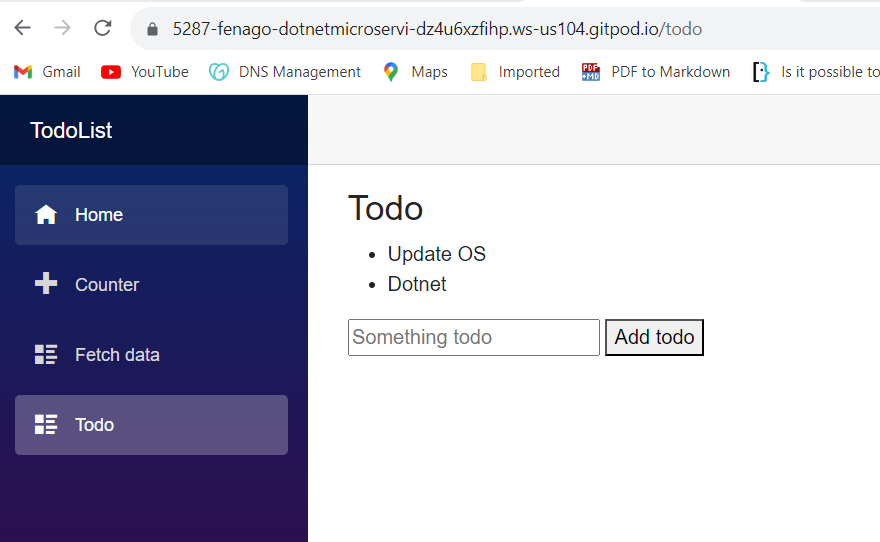
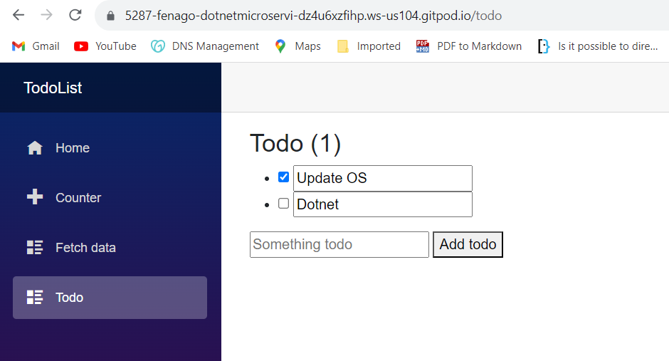

#### Lab: Build a Blazor todo list app

This lab provides working experience for building and modifying a Blazor app.


Learn how to:

-   Create a todo list Blazor app project
-   Modify Razor components
-   Use event handling and data binding in components
-   Use routing in a Blazor app


At the end of this lab, you\'ll have a working todo list app.


##### Create a Blazor app

For an experience with Blazor Server, create the app with the following command:

```
dotnet new blazorserver -o TodoList
```

The preceding command creates a folder named `TodoList` with the
`-o|--output` option to hold the app. The `TodoList` folder is the *root
folder* of the project. Change directories to the `TodoList` folder with
the following command:


```
cd TodoList
```


##### Build a todo list Blazor app {#build-a-todo-list-blazor-app .heading-anchor}


Add a new `Todo` Razor component to the app using the following command:


```
dotnet new razorcomponent -n Todo -o Pages
```

The `-n|--name` option in the preceding command specifies the name of
the new Razor component. The new component is created in the project\'s
`Pages` folder with the `-o|--output` option.


[]{.docon .docon-status-info-outline aria-hidden="true"} Important

Razor component file names require a capitalized first letter. Open the
`Pages` folder and confirm that the `Todo` component file name starts
with a capital letter `T`. The file name should be `Todo.razor`.


Open the `Todo` component in any file editor and make the following
changes at the top of the file:

-   Add an `@page` Razor directive with a relative URL of `/todo`.
-   Add the `[RenderModeServer]` attribute. The attribute indicates that
    for this component the render mode should be server-side rendering
    (SSR), which means that the `Todo` component is rendered
    interactively on the server via Blazor Server hosting with
    server-side prerendering.
-   Add a page title with the `PageTitle` component, which enables
    adding an HTML `<title>` element to the page.


Open the `Todo` component in any file editor and make the following
changes at the top of the file:

-   Add an `@page` Razor directive with a relative URL of `/todo`.
-   Add a page title with the `PageTitle` component, which enables
    adding an HTML `<title>` element to the page.


Open the `Todo` component in any file editor and add an `@page` Razor
directive with a relative URL of `/todo`.


`Pages/Todo.razor`:


```
@page "/todo"

<PageTitle>Todo</PageTitle>

<h3>Todo</h3>

@code {

}
```


Save the `Pages/Todo.razor` file.

Add the `Todo` component to the navigation bar.

The `NavMenu` component is used in the app\'s layout. Layouts are
components that allow you to avoid duplication of content in an app. The
`NavLink` component provides a cue in the app\'s UI when the component
URL is loaded by the app.

In the navigation element (`<nav>`) content of the `NavMenu` component,
add the following `<div>` element for the `Todo` component.

In `Shared/NavMenu.razor`:


```
<div class="nav-item px-3">
    <NavLink class="nav-link" href="todo">
        <span class="oi oi-list-rich" aria-hidden="true"></span> Todo
    </NavLink>
</div>
```


Save the `Shared/NavMenu.razor` file.

Build and run the app by executing the `dotnet watch run` command in the command shell from the `TodoList` folder. 

After the app
is running, visit the new Todo page by selecting the **`Todo`** link in
the app\'s navigation bar, which loads the page at `/todo`.

Leave the app running the command shell. Each time a file is saved, the
app is automatically rebuilt, and the page in the browser is
automatically reloaded.

Add a `TodoItem.cs` file to the root of the project (the `TodoList`
folder) to hold a class that represents a todo item. Use the following
C# code for the `TodoItem` class.


`TodoItem.cs`:


```
public class TodoItem
{
    public string? Title { get; set; }
    public bool IsDone { get; set; }
}
```


Return to the `Todo` component and perform the following tasks:

-   Add a field for the todo items in the `@code` block. The `Todo`
    component uses this field to maintain the state of the todo list.
-   Add unordered list markup and a `foreach` loop to render each todo
    item as a list item (`<li>`).

`Pages/Todo.razor`:


```
@page "/todo"

<PageTitle>Todo</PageTitle>

<h3>Todo</h3>

<ul>
    @foreach (var todo in todos)
    {
        <li>@todo.Title</li>
    }
</ul>

@code {
    private List<TodoItem> todos = new();
}
```


The app requires UI elements for adding todo items to the list. Add a
text input (`<input>`) and a button (`<button>`) below the unordered
list (`<ul>...</ul>`):


```
@page "/todo"

<PageTitle>Todo</PageTitle>

<h3>Todo</h3>

<ul>
    @foreach (var todo in todos)
    {
        <li>@todo.Title</li>
    }
</ul>

<input placeholder="Something todo" />
<button>Add todo</button>

@code {
    private List<TodoItem> todos = new();
}
```


Save the `TodoItem.cs` file and the updated `Pages/Todo.razor` file. In
the command shell, the app is automatically rebuilt when the files are
saved. The browser reloads the page.

When the **`Add todo`** button is selected, nothing happens because an
event handler isn\'t attached to the button.

**Note:** We are making following changes in `Pages/Todo.razor`:


1. Add an `AddTodo` method to the `Todo` component and register the method
for the button using the `@onclick` attribute. The `AddTodo` C# method
is called when the button is selected.

2. To get the title of the new todo item, add a `newTodo` string field at
the top of the `@code` block.

3. Modify the text `<input>` element to bind `newTodo` with the `@bind`
attribute.

4. Update the `AddTodo` method to add the `TodoItem` with the specified
title to the list. Clear the value of the text input by setting
`newTodo` to an empty string.


```
@page "/todo"

<PageTitle>Todo</PageTitle>

<h3>Todo</h3>

<ul>
    @foreach (var todo in todos)
    {
        <li>@todo.Title</li>
    }
</ul>

<input placeholder="Something todo" @bind="newTodo" />
<button @onclick="AddTodo">Add todo</button>

@code {
    private List<TodoItem> todos = new();
    private string? newTodo;

    private void AddTodo()
    {
        if (!string.IsNullOrWhiteSpace(newTodo))
        {
            todos.Add(new TodoItem { Title = newTodo });
            newTodo = string.Empty;
        }
    }
}
```


Save the `Pages/Todo.razor` file. The app is automatically rebuilt in
the command shell, and the page reloads in the browser.



The title text for each todo item can be made editable, and a checkbox
can help the user keep track of completed items. Add a checkbox input
for each todo item and bind its value to the `IsDone` property. Change
`@todo.Title` to an `<input>` element bound to `todo.Title` with
`@bind`:


```
<ul>
      @foreach (var todo in todos)
      {
         <li>
            <input type="checkbox" @bind="todo.IsDone" />
            <input @bind="todo.Title" />
         </li>
      }
</ul>
```

Update the `<h3>` header to show a count of the number of todo items
that aren\'t complete (`IsDone` is `false`). The Razor expression in the
following header evaluates each time Blazor rerenders the component.


```
<h3>Todo (@todos.Count(todo => !todo.IsDone))</h3>
```

Save the `Pages/Todo.razor` file. The app is automatically rebuilt in
the command shell, and the page reloads in the browser.




Add items, edit items, and mark todo items done to test the component.

When finished, shut down the app in the command shell by running the keyboard command [Ctrl]+[C] to stop an app.


